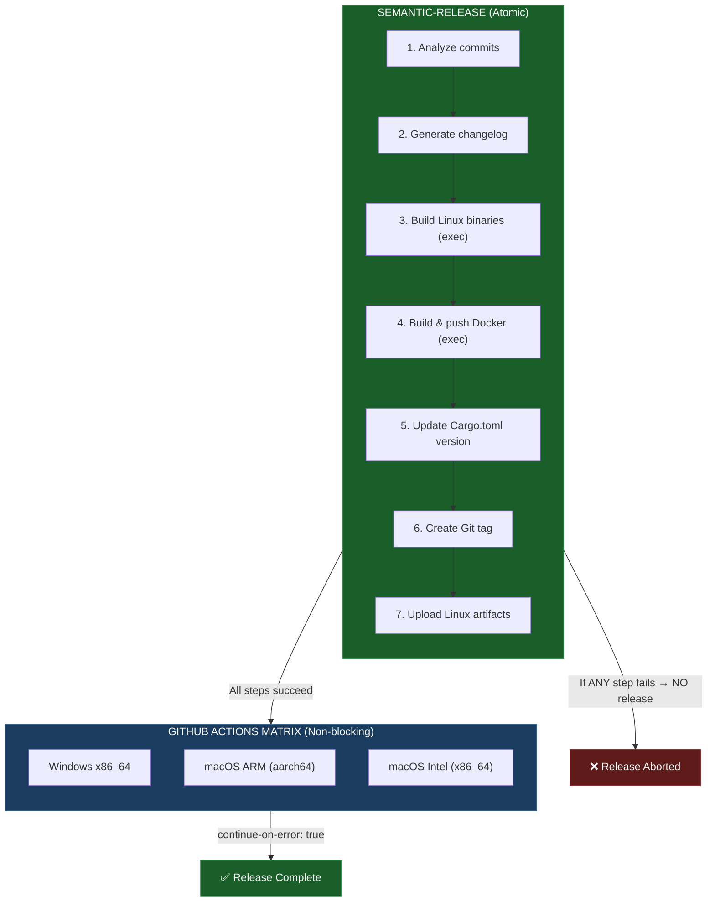

# Release Strategy

This project uses a **hybrid release strategy** that ensures atomic releases while supporting multiple platforms.

---

## Overview



---

## Why Hybrid?

| Approach | Pros | Cons |
|----------|------|------|
| **All in semantic-release** | Atomic, all-or-nothing | Single runner, no parallelism |
| **All in GitHub Actions** | Parallel builds | Release can exist without artifacts |
| **Hybrid (our choice)** | Critical builds atomic, extra platforms parallel | Slight complexity |

---

## Release Scripts

Located in `scripts/release/`:

| Script | Purpose | When |
|--------|---------|------|
| `prepare-artifacts.sh` | Creates `dist/` directory | `prepareCmd` |
| `build-linux.sh` | Builds Linux x86_64 binaries | `publishCmd` |
| `build-docker.sh` | Builds & pushes Docker images | `publishCmd` |

---

## Artifacts Generated

### Atomic (always available if release exists)

| Artifact | Description |
|----------|-------------|
| `ev-server-x86_64-unknown-linux-gnu.tar.gz` | API server (Linux) |
| `ev-etl-x86_64-unknown-linux-gnu.tar.gz` | ETL tool (Linux) |
| `ghcr.io/open-ev-data/ev-server:X.Y.Z` | Docker image (API) |
| `ghcr.io/open-ev-data/ev-etl:X.Y.Z` | Docker image (ETL) |

### Extra Platforms (best-effort)

| Artifact | Description |
|----------|-------------|
| `ev-server-x86_64-pc-windows-msvc.zip` | API server (Windows) |
| `ev-etl-x86_64-pc-windows-msvc.zip` | ETL tool (Windows) |
| `ev-server-aarch64-apple-darwin.tar.gz` | API server (macOS ARM) |
| `ev-etl-aarch64-apple-darwin.tar.gz` | ETL tool (macOS ARM) |
| `ev-server-x86_64-apple-darwin.tar.gz` | API server (macOS Intel) |
| `ev-etl-x86_64-apple-darwin.tar.gz` | ETL tool (macOS Intel) |

---

## Using Artifacts

### Download from Release

```bash
gh release download v1.0.0 -R open-ev-data/open-ev-data-api -p 'ev-etl-x86_64-unknown-linux-gnu.tar.gz'
tar -xzf ev-etl-x86_64-unknown-linux-gnu.tar.gz
./ev-etl --help
```

### Use Docker Image

```bash
docker run -v $(pwd)/src:/data/input -v $(pwd)/output:/data/output \
  ghcr.io/open-ev-data/ev-etl:latest

docker run -p 3000:3000 -v $(pwd)/vehicles.db:/app/vehicles.db \
  ghcr.io/open-ev-data/ev-server:latest
```

---

## Dataset Repository Integration

The Dataset repository can use ev-etl to regenerate artifacts:

```yaml
# .github/workflows/generate-artifacts.yml
jobs:
  generate:
    runs-on: ubuntu-latest
    steps:
      - uses: actions/checkout@v4

      - name: Run ETL
        run: |
          docker run -v ${{ github.workspace }}/src:/data/input \
                     -v ${{ github.workspace }}/output:/data/output \
                     ghcr.io/open-ev-data/ev-etl:latest
```

---

## Configuration Files

| File | Purpose |
|------|---------|
| `package.json` | semantic-release plugins and exec commands |
| `.github/workflows/release.yml` | GitHub Actions workflow |
| `scripts/release/*.sh` | Build scripts |
| `docker/Dockerfile` | ev-server image |
| `docker/Dockerfile.etl` | ev-etl image |
