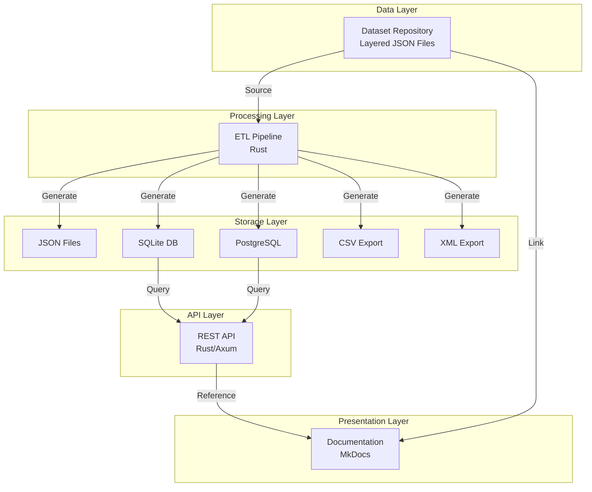
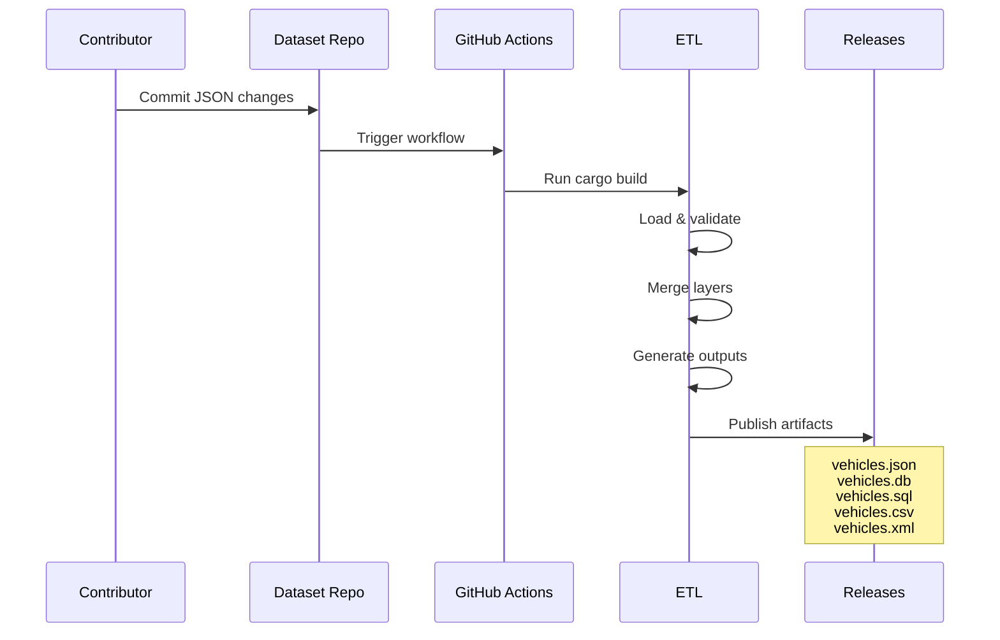
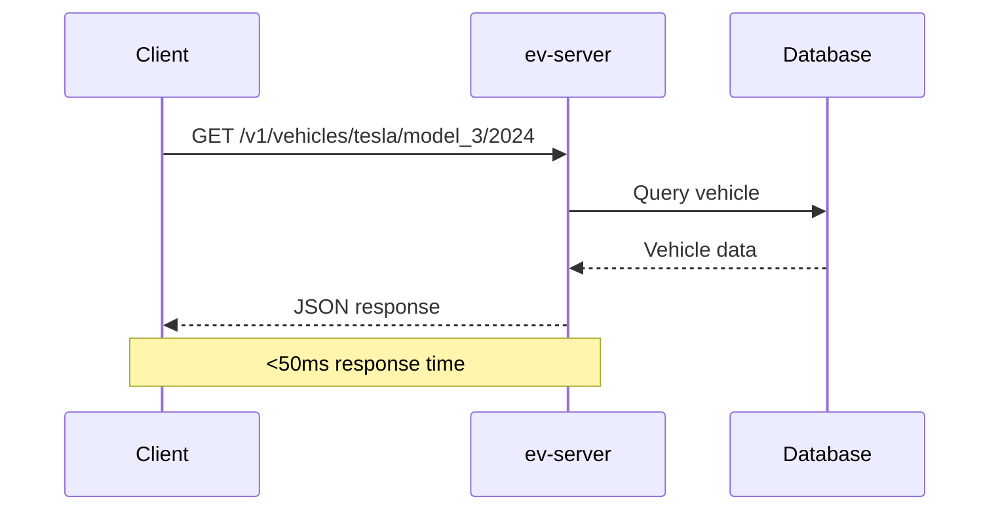
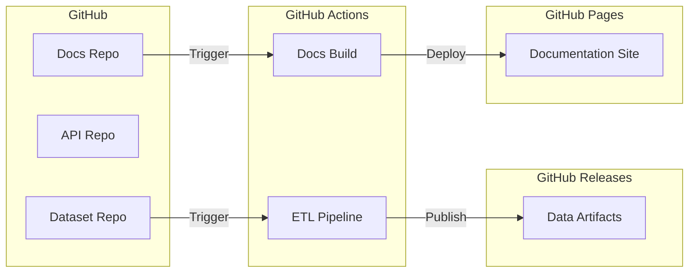

# Architecture Overview

OpenEV Data is designed as a modular, scalable system following best practices in software architecture and data engineering.

## System Components

The OpenEV Data ecosystem consists of four main components:



## Repository Structure

### 1. Dataset Repository

**Purpose**: Single source of truth for EV specifications

**Technology**: JSON, JSON Schema

**Architecture**: Layered Canonical Dataset (LCD)

The dataset follows a hierarchical structure:

```
src/
  <make>/
    <model>/
      base.json              # Shared specifications
      <year>/
        <vehicle>.json       # Base vehicle
        <vehicle>_<variant>.json  # Variants
```

**Key Features**:

- Deep merge inheritance
- Strict schema validation
- Version controlled
- Community reviewed

[Read detailed Dataset Architecture →](dataset/architecture.md)

### 2. API Repository

**Purpose**: High-performance data processing and API serving

**Technology**: Rust, Axum, SQLite, PostgreSQL

**Architecture**: Hexagonal Architecture (Ports and Adapters)

The API follows a clean architecture pattern:

```
crates/
  ev-core/        # Domain types (Pure Rust)
  ev-etl/         # ETL pipeline (CLI)
  ev-server/      # REST API server
```

**Key Features**:

- Type-safe domain model
- Multiple output formats
- Edge-ready deployment
- <50ms response times

[Read detailed API Architecture →](api/architecture.md)

### 3. Documentation Repository

**Purpose**: Centralized documentation and guides

**Technology**: MkDocs, Material Theme, Python

**Architecture**: Static site generation with versioning

**Key Features**:

- Automatic deployment
- Version management with mike
- Search functionality
- Material design

You're reading it right now!

### 4. Governance Repository

**Purpose**: Organization-wide policies and templates

**Technology**: Markdown, GitHub templates

**Contents**:

- Contributing guidelines
- Code of conduct
- Issue templates
- Pull request templates
- Workspace configuration

## Data Flow

### Build-Time Pipeline



### Runtime API Flow



## Architectural Principles

### 1. Separation of Concerns

Each repository has a single, well-defined responsibility:

- **Dataset**: Data curation
- **API**: Data processing and serving
- **Docs**: Documentation
- **Governance**: Policies and templates

### 2. Data as Code

All vehicle specifications are:

- Version controlled (Git)
- Reviewed (Pull Requests)
- Validated (Schema + CI)
- Traceable (Sources)

### 3. Build-Time Optimization

Heavy processing happens once during builds:

- Layer merging
- Schema validation
- Format conversion
- Index generation

Runtime is optimized for reads.

### 4. Multiple Consumption Patterns

The same source data powers:

- Direct file downloads
- REST API access
- Embedded databases
- Bulk SQL imports
- CSV analysis

### 5. Type Safety

Rust's type system prevents invalid states:

- Compile-time guarantees
- No null pointer errors
- Exhaustive pattern matching
- Zero-cost abstractions

### 6. Global Performance

API deployed at the edge:

- Production-ready deployments
- Low-latency worldwide access
- Automatic scaling

## Design Patterns

### Dataset: Layered Canonical Dataset (LCD)

Inspired by configuration management systems, LCD provides:

- **Inheritance**: Base → Year → Variant
- **DRY**: No repeated data
- **Deterministic**: Same input = same output
- **Traceable**: Clear data lineage

### API: Hexagonal Architecture

Clean separation between:

- **Core**: Pure domain logic
- **Adapters**: I/O implementations
- **Ports**: Abstract interfaces

Benefits:

- Testable without I/O
- Swappable implementations
- Framework independent

### Documentation: Docs as Code

Documentation follows software practices:

- Version controlled
- CI/CD deployment
- Automated versioning
- Pull request reviews

## Technology Choices

### Why Rust?

1. **Performance**: Near C/C++ speed
2. **Safety**: No segfaults, no data races
3. **Tooling**: Cargo, rustfmt, clippy
4. **Community**: Growing ecosystem

### Why MkDocs Material?

1. **Beautiful**: Modern, responsive design
2. **Features**: Search, navigation, tabs
3. **Extensions**: Mermaid, admonitions, code highlighting
4. **Versioning**: Built-in support with mike
5. **Fast**: Static site generation

### Why JSON Schema?

1. **Standard**: Industry-standard validation
2. **Language-agnostic**: Works everywhere
3. **Documentation**: Self-documenting schema
4. **Tooling**: Wide ecosystem support
5. **Strict**: Catches errors early

## Deployment Architecture

### Current




## Quality Assurance

### Dataset Quality

- Schema validation
- Source verification
- Peer review
- Automated checks

### Code Quality

- Unit tests
- Integration tests
- Clippy linting
- Format checking

### Documentation Quality

- Link checking
- Spell checking
- Preview builds
- Version tracking

## Scalability

### Data Growth

The architecture supports:

- **Thousands of vehicles**: Efficient indexing
- **Multiple variants**: Layered structure
- **Historical data**: Version tracking
- **International markets**: Multi-source support

### API Scaling

The API scales through:

- **Horizontal scaling**: Stateless design
- **Caching**: Database in memory
- **CDN**: Static asset delivery
- **Edge deployment**: Global distribution

## Security

### Data Integrity

- Git commit signing
- Pull request reviews
- CI validation
- Checksum verification

### API Security

- HTTPS only
- CORS configuration
- Rate limiting (planned)
- API keys (planned)

## Next Steps

Explore specific architectures:

<div class="grid cards" markdown>

-   [**Dataset Architecture**](dataset/architecture.md)
    
    Layered data structure

-   [**API Architecture**](api/architecture.md)
    
    Hexagonal architecture in Rust

-   [**Contributing Guide**](../guides/contributing.md)
    
    Start contributing

-   [**API Reference**](api/endpoints.md)
    
    Complete API documentation

</div>

