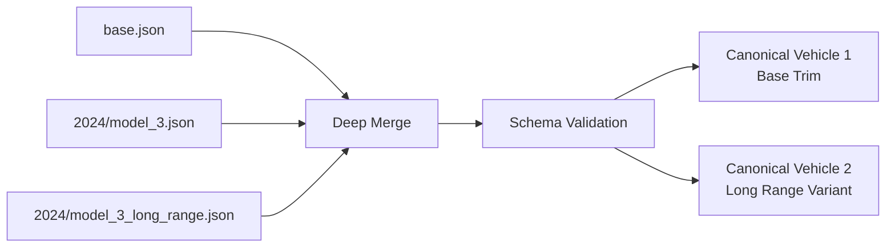

# Dataset Architecture

!!! info "Complete Documentation"
    This page provides an overview of the dataset architecture. For complete technical details, see the [Dataset Architecture Documentation](https://github.com/open-ev-data/open-ev-data-dataset/blob/main/docs/ARCHITECTURE.md) in the dataset repository.

## Architectural Style: Layered Canonical Dataset (LCD)

The OpenEV Data Dataset follows a **Layered Canonical Dataset (LCD)** architecture - a directory-driven, inheritance-based data model where **vehicle specifications are authored as layered JSON fragments** and compiled into **canonical, fully-expanded vehicle records**.

### Why LCD?

- **Eliminates repetition**: Shared attributes live in `base.json` and are inherited
- **Deterministic builds**: Same input produces same output
- **Low-friction contributions**: Edit small, localized JSON files
- **Supports variants cleanly**: Single base generates multiple canonical vehicles
- **Global correctness**: Strict contract ensures consistency

## Repository Layout

The dataset is authored under `src/` with this structure:

```text
src/
  <make_slug>/
    <model_slug>/
      base.json
      <year>/
        <vehicle_slug>.json
        <vehicle_slug>_<variant_slug>.json
```

### Example: BMW iX1

```text
src/
  bmw/
    ix1/
      base.json
      2024/
        ix1.json
        ix1_350_autonomy.json
      2025/
        ix1.json
```

## Merge Precedence

The build process merges layers with this precedence (lowest → highest):

1. **Model Base** (`base.json`) - Shared across all years
2. **Year Base** (`<vehicle>.json`) - Specific year configuration
3. **Variant** (`<vehicle>_<variant>.json`) - Delta from year base

### Merge Rules

- **Objects**: Deep merge by key (recursive)
- **Scalars**: Replace (higher precedence wins)
- **Arrays**: Complete replacement (no concatenation)
- **Null values**: Not allowed
- **Unknown keys**: Validation failure

## File Structure

### Base File (`base.json`)

Contains specifications stable across years:

```json
{
  "schema_version": "1.0.0",
  "make": {
    "slug": "tesla",
    "name": "Tesla"
  },
  "model": {
    "slug": "model_3",
    "name": "Model 3"
  },
  "vehicle_type": "sedan",
  "body": {
    "style": "sedan",
    "doors": 4,
    "seats": 5
  }
}
```

### Year Base File (`model_3.json`)

Contains year-specific specifications:

```json
{
  "schema_version": "1.0.0",
  "year": 2024,
  "trim": {
    "slug": "base",
    "name": "Base"
  },
  "battery": {
    "pack_capacity_kwh_net": 60.0,
    "thermal_management": "liquid"
  },
  "range": {
    "rated": [
      {
        "cycle": "wltp",
        "range_km": 513
      }
    ]
  },
  "sources": [
    {
      "type": "oem",
      "title": "Official Specifications",
      "url": "https://tesla.com/model3",
      "accessed_at": "2025-12-25T00:00:00Z"
    }
  ]
}
```

### Variant File (`model_3_long_range.json`)

Contains only differences from base:

```json
{
  "schema_version": "1.0.0",
  "variant": {
    "slug": "long_range",
    "name": "Long Range",
    "kind": "range_upgrade"
  },
  "battery": {
    "pack_capacity_kwh_net": 82.0
  },
  "range": {
    "rated": [
      {
        "cycle": "wltp",
        "range_km": 629
      }
    ]
  },
  "sources": [
    {
      "type": "oem",
      "title": "Long Range Specifications",
      "url": "https://tesla.com/model3/design#range",
      "accessed_at": "2025-12-25T00:00:00Z"
    }
  ]
}
```

## Compilation Process

The ETL pipeline compiles layered files into canonical vehicles:



### Output Cardinality

- Each `<vehicle>.json` produces **one canonical vehicle**
- Each `<vehicle>_<variant>.json` produces **one additional canonical vehicle**

Example: `model_3.json` + `model_3_long_range.json` = **2 canonical vehicles**

## When to Create a Variant

Create a separate variant when changes affect:

- Range rating (any test cycle)
- Battery capacity or voltage class
- Drivetrain or motor configuration
- Charging capability (AC/DC power, connector, protocols)
- DC charge curve or charge times
- V2X capability
- Official performance metrics
- Regulatory classification

## Naming Conventions

### Slugs

All slugs must:

- Be lowercase ASCII
- Use `a-z`, `0-9`, and underscore `_` only
- Not start or end with `_`
- Be stable over time

**Good Examples**:

- `tesla`
- `model_3`
- `long_range`
- `performance`

**Bad Examples**:

- `Tesla` (uppercase)
- `model-3` (hyphen)
- `_base` (leading underscore)
- `Model 3` (space)

## Validation Pipeline

Each canonical vehicle must pass:

1. **JSON Schema Validation**: Against `schema.json`
2. **Required Fields Check**: All mandatory fields present
3. **Type Validation**: Correct data types
4. **Business Rules**:
   - At least one battery capacity
   - At least one charge port
   - At least one rated range
   - At least one source
   - Valid slug patterns
5. **Referential Integrity**: Variants reference valid base vehicles

## Professional Data Quality Requirements

- **No unverifiable claims**: Every spec must have sources
- **Market ambiguity must be explicit**: Specify markets when limited
- **Avoid marketing ambiguity**: Use numeric, test-cycle-qualified values
- **Prefer net capacity**: Store both gross and net when available
- **Charging data must declare context**: Disclose SOC window and conditions
- **Keep variants minimal**: Variants are deltas, not full copies

## Complete Documentation

For detailed technical specifications, examples, and advanced topics:

[**Read Complete Architecture Documentation** →](https://github.com/open-ev-data/open-ev-data-dataset/blob/main/docs/ARCHITECTURE.md)

## Related Documentation

<div class="grid cards" markdown>

-   [**Schema Reference**](schema.md)
    
    Field-by-field documentation

-   [**Adding a Vehicle**](../../guides/adding-vehicle.md)
    
    Step-by-step guide

-   [**Data Quality**](../../guides/data-quality.md)
    
    Quality standards

-   [**API Architecture**](../api/architecture.md)
    
    How data is processed

</div>

