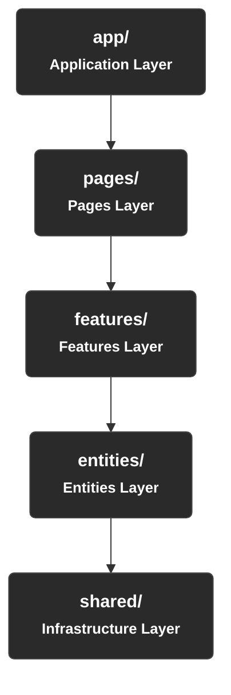
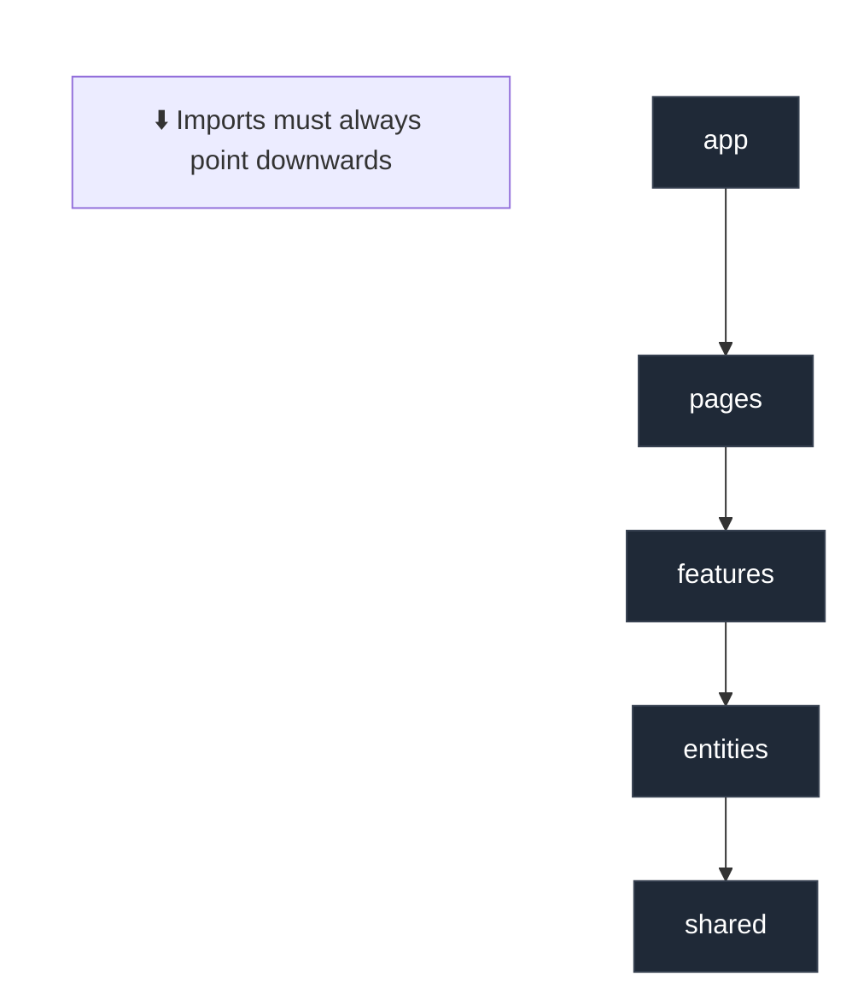
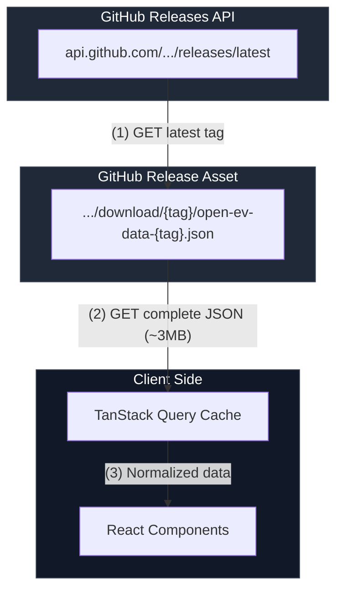

# Project Architecture

This document covers the technical architecture, FSD layers, data flow, state management, and development principles. For visual design specifications, see the [Visual Design System](#related-documentation) documents.

### Related Documentation

| Document                                           | Scope                                                    |
| -------------------------------------------------- | -------------------------------------------------------- |
| [Design System](DESIGN_SYSTEM.md)                  | Color palette, typography, spacing, design tokens        |
| [UI Components](UI_COMPONENTS.md)                  | Component specs, variants, states, data-driven rendering |
| [Responsive Strategy](RESPONSIVE_STRATEGY.md)      | Breakpoints, viewport adaptations, touch behavior        |
| [Page Layouts](PAGE_LAYOUTS.md)                    | Page-level structure and component composition           |
| [Getting Started](GET_STARTED.md)                  | Setup instructions and development workflow              |
| [Schema Reference](schema/reference_20260216.json) | Vehicle data field definitions (required vs optional)    |

The following main topics are addressed:

## Table of Contents

- [Technologies](#technologies)
- [Architecture](#architecture)
  - [Feature-Sliced Design (FSD) — Adapted](#feature-sliced-design-fsd--adapted)
  - [Data Flow](#data-flow)
- [Principles](#principles)
- [File Tree](#file-tree)
- [Component Organization](#component-organization)
  - [Component Layers](#component-layers)
  - [Component Rules](#component-rules)
- [State Management](#state-management)
- [Data Fetching](#data-fetching)
- [Routing](#routing)
- [Testing](#testing)
- [CI/CD and Deployment](#cicd-and-deployment)

---

## Technologies

The project uses the following technologies with their respective versions:

### Runtime Environment

| Technology  | Version  | Purpose                 |
| ----------- | -------- | ----------------------- |
| **Node.js** | `22 LTS` | Runtime for build tools |
| **npm**     | `10+`    | Package manager         |

### Core

| Technology     | Version | Purpose                                   |
| -------------- | ------- | ----------------------------------------- |
| **React**      | `19.2`  | UI library (components, hooks, Suspense)  |
| **React DOM**  | `19.2`  | Browser rendering                         |
| **TypeScript** | `5.7+`  | Static typing and type safety             |
| **Vite**       | `7.3.1` | Bundler and dev server (ESBuild + Rollup) |

### Routing and State

| Technology         | Version | Purpose                                       |
| ------------------ | ------- | --------------------------------------------- |
| **React Router**   | `7+`    | Declarative routing for SPA                   |
| **TanStack Query** | `5+`    | Cache, fetch, and remote data synchronization |

### Styling

| Technology                | Version       | Purpose                                                             |
| ------------------------- | ------------- | ------------------------------------------------------------------- |
| **CSS Modules**           | (native Vite) | Local scope styles per component                                    |
| **CSS Custom Properties** | (native)      | Design tokens and themes — see [DESIGN_SYSTEM.md](DESIGN_SYSTEM.md) |

### Quality and Testing

| Technology                | Version | Purpose                                      |
| ------------------------- | ------- | -------------------------------------------- |
| **Vitest**                | `3+`    | Unit and integration tests (Vite-compatible) |
| **React Testing Library** | `16+`   | Component tests based on user behavior       |
| **Playwright**            | `1.50+` | End-to-end (E2E) tests in real browser       |
| **ESLint**                | `9+`    | Static code linting                          |
| **Prettier**              | `3+`    | Consistent code formatting                   |

### Infrastructure

| Technology           | Version | Purpose                           |
| -------------------- | ------- | --------------------------------- |
| **GitHub Actions**   | —       | CI/CD (lint, test, build, deploy) |
| **GitHub Pages**     | —       | Static SPA hosting                |
| **semantic-release** | `24+`   | Automated versioning and releases |

> [!NOTE]
> **Why not TailwindCSS?** The project opts for CSS Modules + Custom Properties to maintain zero style runtime dependencies, full control over the design system, and alignment with the OpenEV Data ecosystem's simplicity principle.

> [!NOTE]
> **Why TanStack Query instead of a global state manager like Redux/Zustand?** The only relevant async state in the application is the vehicle JSON fetched from GitHub. TanStack Query natively handles cache, refetch, stale-while-revalidate, loading, and error states — exactly what the project needs — without the boilerplate of a generic state manager.

---

## Architecture

### Feature-Sliced Design (FSD) — Adapted

The project adopts an adaptation of **Feature-Sliced Design (FSD)**, a frontend architecture developed specifically for modular React applications. FSD organizes code into **hierarchical layers** with strict dependency rules, ensuring low coupling and high cohesion.

#### Why FSD?

1. **Unidirectional dependency rule**: lower layers never import from upper layers, preventing circular dependencies.
2. **Isolation by feature**: each feature is self-contained with its components, hooks, types, and styles.
3. **Predictable scalability**: adding new features doesn't affect existing features.
4. **Unidirectional dependency rule**: lower layers never import from upper layers, preventing circular dependencies.
5. **Isolation by feature**: each feature is self-contained with its components, hooks, types, and styles.
6. **Predictable scalability**: adding new features doesn't affect existing features.
7. **Natural testability**: each slice is testable in isolation.
8. **Facilitated onboarding**: the structure documents itself — a file's location reveals its responsibility.

#### FSD Layers (from most restricted to most free)



**Fundamental rule**: each layer can only import from the layer **below** it, never from layers above or from different slices at the same level.



#### Layer Details

| Layer       | Responsibility                                                                                                  | Example                                                  |
| ----------- | --------------------------------------------------------------------------------------------------------------- | -------------------------------------------------------- |
| `app/`      | Application initialization: providers (QueryClient, Router, Theme), global layout, error boundary configuration | `App.tsx`, `providers.tsx`, `router.tsx`                 |
| `pages/`    | Feature composition into routes. Each page is a component that orchestrates features and entities               | `HomePage`, `VehicleDetailPage`, `ComparePage`           |
| `features/` | Use case logic with UI. Each feature is an isolated slice with its own components, hooks, and types             | `vehicle-search/`, `vehicle-filter/`, `vehicle-compare/` |
| `entities/` | Business domain models. TypeScript types, entity display components, and data access hooks                      | `vehicle/` (types, card, TanStack Query hooks)           |
| `shared/`   | Reusable code without domain logic: generic UI components, utility hooks, constants, helpers, design tokens     | `ui/`, `lib/`, `config/`, `types/`                       |

### Data Flow

The diagram below illustrates how data flows from the source (GitHub Releases) to rendering on the user's screen:



#### Two-Step Fetch Strategy

Data fetching follows a two-step process to ensure the UI always consumes the latest available version:

1.  **Version discovery**: `GET https://api.github.com/repos/open-ev-data/open-ev-data-dataset/releases/latest` → extract the `tag_name` (e.g., `v1.24.0`).
2.  **Dataset download**: `GET https://github.com/open-ev-data/open-ev-data-dataset/releases/download/{tag}/open-ev-data-{tag}.json` → load the complete JSON.

> [!IMPORTANT]
> GitHub's public API has a rate limit of **60 requests/hour** for unauthenticated calls. TanStack Query should configure `staleTime` appropriately (e.g., 30 minutes) to avoid unnecessary refetches during the user's session.

---

## Principles

The following principles guide all design and implementation decisions for this project:

### 1. Separation of Concerns (SoC)

Each module, component, and function should have a single, clear responsibility. UI components don't fetch data; data hooks don't render; utilities don't know about domain.

### 2. Dependency Inversion

Upper layers (pages, features) depend on abstractions from lower layers (entities, shared), never the reverse. This makes it possible to swap internal implementations without affecting consumers.

### 3. Composition over Inheritance

Components are built through composition. Prefer `children`, render props, and custom hooks instead of inheritance hierarchies or "god" components with excessive props.

### 4. Colocation

Related files stay close to each other. Styles, tests, types, and components of a feature live inside the feature's directory, not in separate global folders.

### 5. Explicit Contracts

Every public interface (component props, hook return, function parameters) must be explicitly typed with TypeScript. Avoid `any` — use `unknown` when the actual type is not known.

### 6. Immutable Data

Never mutate state directly. Use immutable patterns (spread, `map`, `filter`) and leverage React's functional paradigm (computed derived states, not stored ones).

### 7. Fail-Fast with Graceful Degradation

Errors should be caught as early as possible (compile-time validation via TypeScript), and when inevitable at runtime, handled with Error Boundaries and fallback UI that keeps the user informed.

### 8. Accessibility by Default (a11y)

Components should be accessible from the first implementation: semantic HTML, ARIA attributes when necessary, keyboard navigation support, and adequate contrast.

### 9. Performance as a Feature

Lazy loading of routes via `React.lazy`, conscious memoization (`useMemo`, `useCallback` where measurable), and progressive data loading with Suspense boundaries.

### 10. Convention over Configuration

File names, directory structure, and export patterns follow consistent, documented conventions, minimizing the need for case-by-case configuration.

---

## File Tree

```text
open-ev-data-ui/
├── public/                          # Static files served directly
│   ├── favicon.ico
│   └── robots.txt
│
├── src/
│   ├── app/                         # [LAYER: APP] Bootstrap and configuration
│   │   ├── App.tsx                  # Root component
│   │   ├── App.module.css           # Global layout styles
│   │   ├── providers.tsx            # Provider composition (Query, Router, Theme)
│   │   ├── router.tsx               # Route definitions (lazy-loaded)
│   │   └── error-boundary.tsx       # Global error boundary
│   │
│   ├── pages/                       # [LAYER: PAGES] Route composition
│   │   ├── home/
│   │   │   ├── HomePage.tsx
│   │   │   ├── HomePage.module.css
│   │   │   └── HomePage.test.tsx
│   │   ├── vehicle-detail/
│   │   │   ├── VehicleDetailPage.tsx
│   │   │   ├── VehicleDetailPage.module.css
│   │   │   └── VehicleDetailPage.test.tsx
│   │   ├── compare/
│   │   │   ├── ComparePage.tsx
│   │   │   ├── ComparePage.module.css
│   │   │   └── ComparePage.test.tsx
│   │   └── not-found/
│   │       └── NotFoundPage.tsx
│   │
│   ├── features/                    # [LAYER: FEATURES] Use cases
│   │   ├── vehicle-search/
│   │   │   ├── ui/
│   │   │   │   ├── SearchBar.tsx
│   │   │   │   └── SearchBar.module.css
│   │   │   ├── model/
│   │   │   │   └── use-vehicle-search.ts
│   │   │   └── index.ts             # Feature public API
│   │   ├── vehicle-filter/
│   │   │   ├── ui/
│   │   │   │   ├── FilterPanel.tsx
│   │   │   │   └── FilterPanel.module.css
│   │   │   ├── model/
│   │   │   │   ├── use-vehicle-filters.ts
│   │   │   │   └── filter.types.ts
│   │   │   └── index.ts
│   │   └── vehicle-compare/
│   │       ├── ui/
│   │       │   ├── CompareTable.tsx
│   │       │   └── CompareTable.module.css
│   │       ├── model/
│   │       │   └── use-comparison.ts
│   │       └── index.ts
│   │
│   ├── entities/                    # [LAYER: ENTITIES] Domain
│   │   └── vehicle/
│   │       ├── ui/
│   │       │   ├── VehicleCard.tsx
│   │       │   ├── VehicleCard.module.css
│   │       │   ├── VehicleSpecsTable.tsx
│   │       │   └── VehicleSpecsTable.module.css
│   │       ├── model/
│   │       │   ├── vehicle.types.ts  # TS types derived from schema.json
│   │       │   └── vehicle.helpers.ts
│   │       ├── api/
│   │       │   ├── use-vehicles.ts   # TanStack Query hook (list)
│   │       │   ├── use-vehicle.ts    # TanStack Query hook (detail)
│   │       │   ├── use-makes.ts      # TanStack Query hook (manufacturers)
│   │       │   └── vehicle.api.ts    # Fetch functions (queryFn)
│   │       └── index.ts              # Entity public API
│   │
│   ├── shared/                      # [LAYER: SHARED] Infrastructure
│   │   ├── ui/                      # Generic components (no domain)
│   │   │   ├── Button/
│   │   │   │   ├── Button.tsx
│   │   │   │   ├── Button.module.css
│   │   │   │   └── Button.test.tsx
│   │   │   ├── Input/
│   │   │   ├── Spinner/
│   │   │   ├── Badge/
│   │   │   ├── Card/
│   │   │   ├── Modal/
│   │   │   ├── Pagination/
│   │   │   ├── Select/
│   │   │   └── ErrorFallback/
│   │   ├── lib/                     # Pure utility functions
│   │   │   ├── format.ts            # Value formatting (kW, km, etc.)
│   │   │   ├── sort.ts              # Generic sorting functions
│   │   │   └── github.ts            # Release URL resolution logic
│   │   ├── config/                  # Constants and configuration
│   │   │   ├── env.ts               # Typed environment variables
│   │   │   └── constants.ts         # Application constants
│   │   ├── styles/                  # Design tokens and global styles
│   │   │   ├── tokens.css           # Custom Properties (colors, spacing, typography)
│   │   │   ├── reset.css            # CSS reset/normalize
│   │   │   ├── global.css           # Minimal global styles
│   │   │   └── breakpoints.css      # Reusable media queries
│   │   └── types/                   # Global types and type utilities
│   │       └── common.ts
│   │
│   ├── main.tsx                     # Entry point (ReactDOM.createRoot)
│   └── vite-env.d.ts                # Vite types
│
├── e2e/                             # End-to-end tests (Playwright)
│   ├── home.spec.ts
│   ├── vehicle-detail.spec.ts
│   └── playwright.config.ts
│
├── docs/                            # Project documentation
│   ├── ARCHITECTURE.md              # This document
│   └── GET_STARTED.md               # Setup and contribution guide
│
├── .github/
│   └── workflows/
│       ├── ci.yml                   # Lint, test, build
│       └── deploy.yml               # Build + deploy to GitHub Pages
│
├── index.html                       # HTML entry point (Vite)
├── vite.config.ts                   # Vite configuration
├── tsconfig.json                    # TypeScript configuration
├── tsconfig.app.json                # TS config for application code
├── tsconfig.node.json               # TS config for Node scripts
├── eslint.config.js                 # ESLint configuration (flat config)
├── .prettierrc                      # Prettier configuration
├── .releaserc.js                    # semantic-release configuration
├── package.json
└── README.md
```

### Naming Conventions

| Type                  | Convention                       | Example                                               |
| --------------------- | -------------------------------- | ----------------------------------------------------- |
| React components      | `PascalCase`                     | `VehicleCard.tsx`                                     |
| Custom hooks          | `camelCase` with `use` prefix    | `use-vehicles.ts`                                     |
| Utilities and helpers | `camelCase`                      | `format.ts`                                           |
| Type files            | `.types.ts` suffix               | `vehicle.types.ts`                                    |
| CSS Modules           | `.module.css` suffix             | `VehicleCard.module.css`                              |
| Tests                 | `.test.tsx` or `.test.ts` suffix | `VehicleCard.test.tsx`                                |
| Directories           | `kebab-case`                     | `vehicle-search/`                                     |
| Barrel exports        | `index.ts`                       | Each feature/entity exposes public API via `index.ts` |

---

## Component Organization

### Component Layers

Components follow a clear three-layer hierarchy:

#### 1. UI Components (`shared/ui/`)

Purely visual components without domain logic. They receive data via props and emit events via callbacks. They are reusable in any context.

```tsx
// ✅ Correct: generic component, no knowledge of "vehicle"
interface ButtonProps {
  variant: "primary" | "secondary" | "ghost";
  size: "sm" | "md" | "lg";
  children: React.ReactNode;
  onClick?: () => void;
  disabled?: boolean;
}

export function Button({ variant, size, children, ...rest }: ButtonProps) {
  return (
    <button className={styles[variant]} {...rest}>
      {children}
    </button>
  );
}
```

#### 2. Entity Components (`entities/*/ui/`)

Components that visually represent a domain entity. They know the `Vehicle` type but have no use case logic.

```tsx
// ✅ Correct: knows how to render a vehicle, but not how to filter or search
interface VehicleCardProps {
  vehicle: VehicleSummary;
  onSelect?: (code: string) => void;
}

export function VehicleCard({ vehicle, onSelect }: VehicleCardProps) {
  return (
    <Card onClick={() => onSelect?.(vehicle.unique_code)}>
      <h3>
        {vehicle.make.name} {vehicle.model.name}
      </h3>
      <Badge>{vehicle.year}</Badge>
      {/* ... */}
    </Card>
  );
}
```

#### 3. Feature Components (`features/*/ui/`)

Components that implement a complete use case. They connect hooks, local state, and components from lower layers.

```tsx
// ✅ Correct: orchestrates search, state, and rendering
export function SearchBar() {
  const { query, setQuery, results } = useVehicleSearch();

  return (
    <div className={styles.searchBar}>
      <Input
        value={query}
        onChange={setQuery}
        placeholder="Search vehicles..."
      />
      <SearchResults results={results} />
    </div>
  );
}
```

### Component Rules

1.  **Export via barrel (`index.ts`)**: each feature and entity exposes only its public API. Consumers import from `@/features/vehicle-search`, never from internal paths.

2.  **Explicit props**: never use `React.FC` (legacy). Declare an `interface` for props and use function declaration or arrow function.

3.  **Style composition**: use CSS Modules for local scope. Variants and states via composed classes, never inline styles for visual logic.

4.  **Components without side effects**: components don't trigger `fetch` directly. All data access goes through TanStack Query hooks, injected via custom hooks in the `api/` or `model/` layer.

5.  **Maximum limit**: if a component exceeds ~150 lines or receives more than ~8 props, it should be decomposed into smaller components.

---

## State Management

Application state is divided into three categories with distinct strategies:

### 1. Server State

Managed entirely by **TanStack Query**. Includes vehicle data fetched from GitHub.

```tsx
// entities/vehicle/api/vehicle.api.ts
export async function fetchLatestDataset(): Promise<VehicleDataset> {
  const releaseRes = await fetch(GITHUB_LATEST_RELEASE_URL);
  const { tag_name } = await releaseRes.json();
  const dataRes = await fetch(buildAssetUrl(tag_name));
  return dataRes.json();
}

// entities/vehicle/api/use-vehicles.ts
export function useVehicles() {
  return useQuery({
    queryKey: ["vehicles"],
    queryFn: fetchLatestDataset,
    staleTime: 30 * 60 * 1000, // 30 minutes
    select: (data) => data.vehicles, // Extract only the array
  });
}
```

### 2. UI State

Component local state managed with `useState` and `useReducer`. Includes: active filters, search term, modal open/closed, selected vehicles for comparison.

```tsx
// Example: filters are local state, derived from server data
const [filters, setFilters] = useState<VehicleFilters>(defaultFilters);
const { data: vehicles } = useVehicles();

const filtered = useMemo(
  () => applyFilters(vehicles ?? [], filters),
  [vehicles, filters],
);
```

### 3. URL State

Search parameters and filters that should be shareable via URL are synchronized with React Router's `searchParams`.

```tsx
const [searchParams, setSearchParams] = useSearchParams();
const make = searchParams.get("make");
```

> [!TIP]
> **Golden rule**: if state needs to survive a page refresh or be shareable via link, it belongs in the URL. Otherwise, `useState` is sufficient.

---

## Data Fetching

### Data Sources

The project has a single data source: the **canonical JSON** published as a release asset in the `open-ev-data-dataset` repository.

| Endpoint                                                         | Method | Purpose                                |
| ---------------------------------------------------------------- | ------ | -------------------------------------- |
| `api.github.com/.../releases/latest`                             | `GET`  | Discover the latest release `tag_name` |
| `github.com/.../releases/download/{tag}/open-ev-data-{tag}.json` | `GET`  | Download the complete dataset          |

### JSON Structure

The JSON file follows the structure defined in the data repository's [`schema.json`](https://github.com/open-ev-data/open-ev-data-dataset/blob/main/schema.json). The root level has:

```json
{
  "schema_version": "1.0.0",
  "generated_at": "2025-12-30T18:57:12Z",
  "vehicle_count": 406,
  "vehicles": [
    /* array of canonical vehicles */
  ],
  "metadata": { "etl_version": "...", "dataset_commit": "..." }
}
```

Each vehicle in the array contains the fields defined in the schema: `make`, `model`, `year`, `trim`, `variant`, `vehicle_type`, `battery`, `charging`, `range`, `powertrain`, `performance`, `dimensions`, `weights`, `pricing`, `sources`, among others.

### Data Typing

TypeScript types must be generated from `schema.json` to ensure fidelity. The `entities/vehicle/model/vehicle.types.ts` file contains interfaces that faithfully mirror the schema:

```tsx
// ⚠️ Types derived from schema.json — keep in sync
export interface Vehicle {
  schema_version: string;
  unique_code: string;
  make: SlugName;
  model: SlugName;
  year: number;
  trim: SlugName;
  variant?: Variant;
  vehicle_type: VehicleType;
  battery: Battery;
  charging: Charging;
  range: Range;
  powertrain: Powertrain;
  // ... other fields per schema.json
}

export interface SlugName {
  slug: string;
  name: string;
}

export type VehicleType =
  | "passenger_car"
  | "suv"
  | "pickup"
  | "van"
  | "bus"
  | "motorcycle"
  | "scooter"
  | "commercial"
  | "truck"
  | "other";
```

---

## Routing

The application uses **React Router v7** with lazy loading of routes to optimize initial load.

### Route Map

| Route            | Page                | Description                          |
| ---------------- | ------------------- | ------------------------------------ |
| `/`              | `HomePage`          | Vehicle list with search and filters |
| `/vehicle/:code` | `VehicleDetailPage` | Complete details of a vehicle        |
| `/compare`       | `ComparePage`       | Side-by-side vehicle comparison      |
| `*`              | `NotFoundPage`      | 404 page                             |

### Configuration

```tsx
// app/router.tsx
import { lazy } from "react";
import { createBrowserRouter } from "react-router-dom";

const HomePage = lazy(() => import("@/pages/home/HomePage"));
const VehicleDetailPage = lazy(
  () => import("@/pages/vehicle-detail/VehicleDetailPage"),
);
const ComparePage = lazy(() => import("@/pages/compare/ComparePage"));
const NotFoundPage = lazy(() => import("@/pages/not-found/NotFoundPage"));

export const router = createBrowserRouter(
  [
    {
      path: "/",
      element: <AppLayout />,
      errorElement: <ErrorBoundary />,
      children: [
        { index: true, element: <HomePage /> },
        { path: "vehicle/:code", element: <VehicleDetailPage /> },
        { path: "compare", element: <ComparePage /> },
        { path: "*", element: <NotFoundPage /> },
      ],
    },
  ],
  {
    basename: "/open-ev-data-ui", // Required for GitHub Pages
  },
);
```

> [!WARNING]
> Since the application is a SPA hosted on GitHub Pages, it's necessary to configure a 404 redirect to `index.html` (via `404.html` with a redirect script) for client-side routing to work correctly with deep links.

---

## Testing

The testing strategy follows the **testing pyramid** adapted for React frontend applications:

### Testing Pyramid


### Test Layers

#### 1. Unit Tests (Vitest)

- **Scope**: pure functions in `shared/lib/`, isolated hooks, UI components without dependencies.
- **Location**: placed alongside the tested file (`Button.test.tsx` next to `Button.tsx`).
- **Goal**: ensure individual units operate correctly in isolation.

```tsx
// shared/lib/format.test.ts
import { formatPower } from "./format";

describe("formatPower", () => {
  it("formats kilowatts correctly", () => {
    expect(formatPower(150)).toBe("150 kW");
  });

  it('returns "—" for undefined values', () => {
    expect(formatPower(undefined)).toBe("—");
  });
});
```

#### 2. Integration Tests (Vitest + React Testing Library)

- **Scope**: complete features rendered with mocked providers (QueryClient, Router).
- **Location**: `.test.tsx` file inside the feature or page directory.
- **Goal**: verify components interact correctly with each other and with mocked data.

```tsx
// features/vehicle-search/ui/SearchBar.test.tsx
import { render, screen } from "@testing-library/react";
import userEvent from "@testing-library/user-event";
import { SearchBar } from "./SearchBar";
// ... providers wrapper with QueryClient mock

it("filters vehicles when typing in search field", async () => {
  render(<SearchBar />, { wrapper: TestProviders });
  const input = screen.getByPlaceholderText("Search vehicles...");
  await userEvent.type(input, "Tesla");
  expect(screen.getByText("Tesla Model 3")).toBeInTheDocument();
});
```

#### 3. End-to-End Tests (Playwright)

- **Scope**: complete user flows in real browser.
- **Location**: `e2e/` directory at project root.
- **Goal**: validate critical flows end-to-end (search vehicle, view details, compare).

```tsx
// e2e/home.spec.ts
import { test, expect } from "@playwright/test";

test("user searches for a vehicle and views details", async ({ page }) => {
  await page.goto("/");
  await page.getByPlaceholder("Search vehicles...").fill("Model 3");
  await page.getByText("Tesla Model 3").click();
  await expect(
    page.getByRole("heading", { name: /Tesla Model 3/ }),
  ).toBeVisible();
});
```

### Minimum Coverage

| Layer          | Coverage Target    | Predominant Test Type |
| -------------- | ------------------ | --------------------- |
| `shared/lib/`  | 90%+               | Unit                  |
| `shared/ui/`   | 80%+               | Unit + Snapshot       |
| `entities/`    | 80%+               | Integration           |
| `features/`    | 70%+               | Integration           |
| `pages/`       | 60%+               | Integration           |
| Critical flows | 100% of main flows | E2E                   |

---

## CI/CD and Deployment

### CI Pipeline (Pull Requests and Push)

```yaml
# .github/workflows/ci.yml
name: CI

on: [push, pull_request]

jobs:
  quality:
    steps:
      - Checkout
      - Setup Node.js 22
      - npm ci
      - npm run lint # ESLint
      - npm run type-check # tsc --noEmit
      - npm run test # Vitest
      - npm run build # Vite build
```

### Deployment Pipeline (GitHub Pages)

```yaml
# .github/workflows/deploy.yml
name: Deploy

on:
  push:
    branches: [main]

jobs:
  deploy:
    steps:
      - Checkout
      - Setup Node.js 22
      - npm ci
      - npm run build
      - Deploy dist/ to GitHub Pages
```

### Versioning

The project uses **semantic-release** for automatic versioning based on [Conventional Commits](https://www.conventionalcommits.org/):

| Prefix             | Release Type    | Example                            |
| ------------------ | --------------- | ---------------------------------- |
| `fix:`             | Patch (`1.0.x`) | `fix: correct manufacturer filter` |
| `feat:`            | Minor (`1.x.0`) | `feat: add comparison page`        |
| `BREAKING CHANGE:` | Major (`x.0.0`) | Public API changes                 |
