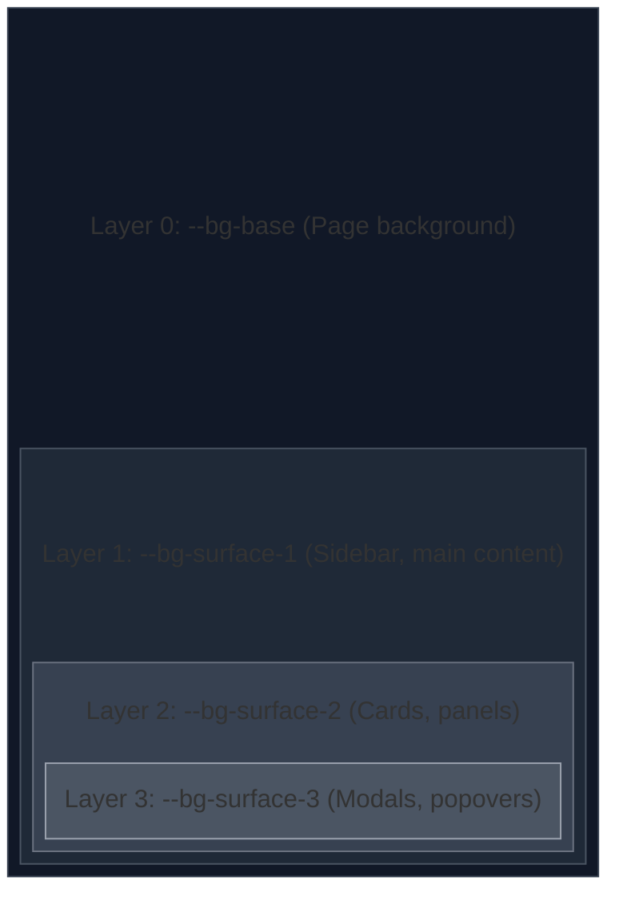

# Design System

This document defines the complete visual language for the Open EV Data UI. Every design token, color, typographic scale, and spacing unit documented here maps directly to CSS Custom Properties in `src/shared/styles/tokens.css`.

### Related Documents

| Document                                           | Scope                                                 |
| -------------------------------------------------- | ----------------------------------------------------- |
| [UI Components](UI_COMPONENTS.md)                  | Component anatomy, variants, and interaction states   |
| [Responsive Strategy](RESPONSIVE_STRATEGY.md)      | Breakpoints, viewport adaptations, touch behavior     |
| [Page Layouts](PAGE_LAYOUTS.md)                    | Page-level structure and component composition        |
| [Architecture](ARCHITECTURE.md)                    | Technical architecture, FSD layers, data flow         |
| [Schema Reference](schema/reference_20260216.json) | Vehicle data field definitions (required vs optional) |

## Table of Contents

- [Design System](#design-system)
    - [Related Documents](#related-documents)
  - [Table of Contents](#table-of-contents)
  - [Design Philosophy](#design-philosophy)
  - [Color System](#color-system)
    - [Core Palette](#core-palette)
      - [Gradient Definitions](#gradient-definitions)
    - [Semantic Colors](#semantic-colors)
    - [Surface and Background Colors](#surface-and-background-colors)
    - [Border Colors](#border-colors)
    - [Text Colors](#text-colors)
    - [State Colors](#state-colors)
    - [Chart and Data Visualization Colors](#chart-and-data-visualization-colors)
  - [Typography](#typography)
    - [Font Family](#font-family)
    - [Type Scale](#type-scale)
    - [Font Weights](#font-weights)
    - [Line Heights](#line-heights)
    - [Letter Spacing](#letter-spacing)
  - [Spacing](#spacing)
  - [Border Radius](#border-radius)
  - [Shadows and Elevation](#shadows-and-elevation)
    - [Elevation Layers](#elevation-layers)
  - [Opacity](#opacity)
  - [Transitions and Animations](#transitions-and-animations)
    - [Transition Durations](#transition-durations)
    - [Easing Functions](#easing-functions)
    - [Precomposed Transitions](#precomposed-transitions)
    - [Animation Keyframes](#animation-keyframes)
  - [Z-Index Scale](#z-index-scale)
  - [Icons and Iconography](#icons-and-iconography)
    - [Icon Library](#icon-library)
    - [Icon Sizing](#icon-sizing)
    - [Icon Color Rules](#icon-color-rules)
  - [Design Token Implementation](#design-token-implementation)
    - [File: `tokens.css`](#file-tokenscss)

---

## Design Philosophy

The Open EV Data UI follows a **dark-first, data-driven** visual approach designed to evoke a premium automotive dashboard experience. The design principles are:

1. **Dark Elegance**: deep, rich dark backgrounds that reduce eye strain and make data visuals pop
2. **Cyan Luminance**: a signature cyan/teal accent that conveys technology, energy, and electric mobility
3. **Glassmorphism Depth**: translucent surfaces with subtle blur that create layer hierarchy without heaviness
4. **Data Clarity**: every visual choice serves readability — high contrast text, structured card layouts, and clear visual grouping
5. **Restrained Animation**: purposeful micro-interactions that provide feedback without distraction
6. **Data-Driven Rendering**: the UI adapts to the data each vehicle actually has — sections, fields, charts, and comparison rows are rendered only when the underlying data exists. No empty states, no placeholder labels for missing values. Components use conditional rendering driven by field presence checks against the [schema](schema/reference_20260216.json). See [UI Components — Data-Driven Rendering](UI_COMPONENTS.md#data-driven-rendering-principle) for implementation patterns

> [!IMPORTANT]
> All color values must be defined as CSS Custom Properties in `tokens.css` and never as hard-coded values in component stylesheets. This ensures consistency and enables future theme extensions (e.g., light mode).

---

## Color System

### Core Palette

The foundational brand colors from which all derived colors are generated.

| Token                     | Value                       | Usage                                  |
| ------------------------- | --------------------------- | -------------------------------------- |
| `--color-primary`         | `hsl(180, 80%, 50%)`        | Primary accent — cyan/teal signature   |
| `--color-primary-light`   | `hsl(180, 80%, 65%)`        | Primary hover states, highlights       |
| `--color-primary-dark`    | `hsl(180, 80%, 35%)`        | Primary pressed states, active borders |
| `--color-primary-muted`   | `hsla(180, 80%, 50%, 0.15)` | Primary tinted backgrounds             |
| `--color-secondary`       | `hsl(150, 70%, 45%)`        | Secondary accent — green for CTAs      |
| `--color-secondary-light` | `hsl(150, 70%, 55%)`        | Secondary hover states                 |
| `--color-secondary-dark`  | `hsl(150, 70%, 35%)`        | Secondary pressed states               |

#### Gradient Definitions

| Token                  | Value                                                                        | Usage                         |
| ---------------------- | ---------------------------------------------------------------------------- | ----------------------------- |
| `--gradient-cta`       | `linear-gradient(135deg, hsl(160, 70%, 40%), hsl(150, 80%, 50%))`            | Compare buttons, primary CTAs |
| `--gradient-cta-hover` | `linear-gradient(135deg, hsl(160, 70%, 45%), hsl(150, 80%, 55%))`            | CTA hover state               |
| `--gradient-surface`   | `linear-gradient(180deg, hsla(200, 40%, 12%, 0.8), hsla(200, 40%, 8%, 0.6))` | Card surfaces                 |
| `--gradient-header`    | `linear-gradient(90deg, hsla(180, 60%, 50%, 0.1), transparent)`              | Header subtle glow            |

### Semantic Colors

Colors tied to specific UI meanings.

| Token             | Value                | Usage                             |
| ----------------- | -------------------- | --------------------------------- |
| `--color-success` | `hsl(145, 65%, 45%)` | Positive indicators, check marks  |
| `--color-warning` | `hsl(40, 90%, 55%)`  | Warning states, caution badges    |
| `--color-error`   | `hsl(0, 75%, 55%)`   | Error states, destructive actions |
| `--color-info`    | `hsl(210, 70%, 55%)` | Informational indicators          |

### Surface and Background Colors

The layered dark background system that creates depth and hierarchy.

| Token                 | Value                       | Usage                                         |
| --------------------- | --------------------------- | --------------------------------------------- |
| `--bg-base`           | `hsl(210, 35%, 7%)`         | Deepest background (page body)                |
| `--bg-surface-1`      | `hsl(210, 30%, 10%)`        | Primary surface (sidebar, main areas)         |
| `--bg-surface-2`      | `hsl(210, 28%, 13%)`        | Elevated surface (cards, panels)              |
| `--bg-surface-3`      | `hsl(210, 25%, 16%)`        | Highest surface (modals, dropdowns, popovers) |
| `--bg-glass`          | `hsla(210, 30%, 12%, 0.7)`  | Glassmorphism surfaces                        |
| `--bg-glass-hover`    | `hsla(210, 30%, 15%, 0.8)`  | Glass surface hover                           |
| `--bg-input`          | `hsl(210, 30%, 9%)`         | Input fields, search bar background           |
| `--bg-card-highlight` | `hsla(180, 60%, 50%, 0.05)` | Selected/highlighted card                     |

### Border Colors

| Token                     | Value                              | Usage                                   |
| ------------------------- | ---------------------------------- | --------------------------------------- |
| `--border-subtle`         | `hsla(210, 20%, 30%, 0.3)`         | Default card/panel borders              |
| `--border-default`        | `hsla(210, 20%, 40%, 0.4)`         | Input borders, dividers                 |
| `--border-strong`         | `hsla(210, 20%, 50%, 0.5)`         | Emphasized borders                      |
| `--border-primary`        | `hsla(180, 80%, 50%, 0.4)`         | Primary-colored borders (selected card) |
| `--border-primary-strong` | `hsla(180, 80%, 50%, 0.7)`         | Primary border hover/active             |
| `--border-glow`           | `0 0 8px hsla(180, 80%, 50%, 0.3)` | Glow effect on selected elements        |

### Text Colors

| Token              | Value                | Usage                                   |
| ------------------ | -------------------- | --------------------------------------- |
| `--text-primary`   | `hsl(210, 15%, 93%)` | Primary text (headings, body)           |
| `--text-secondary` | `hsl(210, 15%, 68%)` | Secondary text (labels, descriptions)   |
| `--text-tertiary`  | `hsl(210, 15%, 48%)` | Tertiary text (placeholders, hints)     |
| `--text-inverse`   | `hsl(210, 35%, 7%)`  | Text on light backgrounds               |
| `--text-accent`    | `hsl(180, 80%, 55%)` | Accent-colored text (links, highlights) |
| `--text-on-cta`    | `hsl(0, 0%, 100%)`   | Text on CTA buttons                     |

### State Colors

| Token                      | Value                       | Usage                    |
| -------------------------- | --------------------------- | ------------------------ |
| `--state-hover`            | `hsla(180, 60%, 50%, 0.08)` | Hover overlay            |
| `--state-active`           | `hsla(180, 60%, 50%, 0.12)` | Active/pressed overlay   |
| `--state-focus-ring`       | `hsla(180, 80%, 50%, 0.5)`  | Focus outline for a11y   |
| `--state-disabled-opacity` | `0.4`                       | Disabled element opacity |

### Chart and Data Visualization Colors

Colors specifically for charts, radar diagrams, and data comparisons.

| Token            | Value                      | Usage                  |
| ---------------- | -------------------------- | ---------------------- |
| `--chart-cyan`   | `hsl(180, 80%, 55%)`       | Primary data series    |
| `--chart-green`  | `hsl(150, 70%, 50%)`       | Secondary data series  |
| `--chart-teal`   | `hsl(165, 60%, 45%)`       | Tertiary data series   |
| `--chart-yellow` | `hsl(50, 80%, 55%)`        | Quaternary data series |
| `--chart-blue`   | `hsl(210, 70%, 55%)`       | Additional series      |
| `--chart-grid`   | `hsla(210, 20%, 40%, 0.2)` | Chart gridlines        |
| `--chart-axis`   | `hsl(210, 15%, 50%)`       | Chart axis labels      |

---

## Typography

### Font Family

| Token            | Value              | Fallback                                                   |
| ---------------- | ------------------ | ---------------------------------------------------------- |
| `--font-primary` | `'Inter'`          | `system-ui, -apple-system, 'Segoe UI', Roboto, sans-serif` |
| `--font-mono`    | `'JetBrains Mono'` | `'Fira Code', 'Cascadia Code', monospace`                  |

> [!NOTE]
> **Inter** is loaded from Google Fonts with weights `400`, `500`, `600`, and `700`. It is known for its excellent readability at small sizes and screen rendering, making it ideal for data-heavy interfaces.

### Type Scale

Based on a **1.200 (Minor Third)** scale with `16px` base.

| Token         | Size | rem      | Usage                                       |
| ------------- | ---- | -------- | ------------------------------------------- |
| `--text-xs`   | 12px | 0.75rem  | Micro labels, captions, unit suffixes       |
| `--text-sm`   | 14px | 0.875rem | Card labels, filter options, secondary info |
| `--text-base` | 16px | 1rem     | Body text, input values, table cells        |
| `--text-md`   | 18px | 1.125rem | Card titles, section labels                 |
| `--text-lg`   | 20px | 1.25rem  | Section headings, panel titles              |
| `--text-xl`   | 24px | 1.5rem   | Page sub-headings                           |
| `--text-2xl`  | 30px | 1.875rem | Page main headings                          |
| `--text-3xl`  | 36px | 2.25rem  | Hero/vehicle name prominences               |
| `--text-4xl`  | 48px | 3rem     | Large display numbers (KPI values)          |

### Font Weights

| Token               | Value | Usage                                    |
| ------------------- | ----- | ---------------------------------------- |
| `--weight-regular`  | `400` | Body text, descriptions                  |
| `--weight-medium`   | `500` | Labels, nav items, card titles           |
| `--weight-semibold` | `600` | Section headings, emphasised data        |
| `--weight-bold`     | `700` | Page titles, KPI values, strong emphasis |

### Line Heights

| Token               | Value  | Usage                        |
| ------------------- | ------ | ---------------------------- |
| `--leading-tight`   | `1.2`  | Headings, large display text |
| `--leading-snug`    | `1.35` | Card titles, compact text    |
| `--leading-normal`  | `1.5`  | Body text, descriptions      |
| `--leading-relaxed` | `1.65` | Long-form content, tooltips  |

### Letter Spacing

| Token               | Value     | Usage                       |
| ------------------- | --------- | --------------------------- |
| `--tracking-tight`  | `-0.02em` | Large headings              |
| `--tracking-normal` | `0`       | Body text                   |
| `--tracking-wide`   | `0.02em`  | Labels, uppercase text      |
| `--tracking-wider`  | `0.05em`  | Small caps, category labels |

---

## Spacing

An 8px-base spacing scale for consistent rhythm across all layouts.

| Token        | Value  | Usage                                   |
| ------------ | ------ | --------------------------------------- |
| `--space-0`  | `0`    | No spacing                              |
| `--space-1`  | `4px`  | Minimal gaps (icon-text, badge padding) |
| `--space-2`  | `8px`  | Tight spacing (intra-component)         |
| `--space-3`  | `12px` | Default component internal padding      |
| `--space-4`  | `16px` | Standard card padding, list gaps        |
| `--space-5`  | `20px` | Section-internal spacing                |
| `--space-6`  | `24px` | Card padding, grid gaps                 |
| `--space-8`  | `32px` | Section padding, large component gaps   |
| `--space-10` | `40px` | Page section margins                    |
| `--space-12` | `48px` | Major layout divisions                  |
| `--space-16` | `64px` | Page-level padding                      |
| `--space-20` | `80px` | Maximum section spacing                 |

> [!TIP]
> Use the spacing tokens exclusively. Never use arbitrary pixel values for margins and paddings. The 4px/8px grid ensures visual alignment across all components.

---

## Border Radius

| Token           | Value    | Usage                                   |
| --------------- | -------- | --------------------------------------- |
| `--radius-sm`   | `4px`    | Small elements (badges, chips)          |
| `--radius-md`   | `8px`    | Buttons, inputs, card inner elements    |
| `--radius-lg`   | `12px`   | Cards, panels, modals                   |
| `--radius-xl`   | `16px`   | Large containers, comparison panel      |
| `--radius-2xl`  | `24px`   | Search bar, prominent CTA buttons       |
| `--radius-full` | `9999px` | Circular elements (avatars, indicators) |

---

## Shadows and Elevation

The shadow system creates depth through subtle, layered shadows on the dark background. Instead of traditional drop-shadows (which are less visible on dark backgrounds), the system emphasizes **glow effects** and **border luminance**.

| Token                   | Value                                | Usage                                  |
| ----------------------- | ------------------------------------ | -------------------------------------- |
| `--shadow-sm`           | `0 1px 3px hsla(0, 0%, 0%, 0.3)`     | Subtle lift (badges, chips)            |
| `--shadow-md`           | `0 4px 12px hsla(0, 0%, 0%, 0.4)`    | Card elevation                         |
| `--shadow-lg`           | `0 8px 24px hsla(0, 0%, 0%, 0.5)`    | Modal, dropdown elevation              |
| `--shadow-xl`           | `0 16px 48px hsla(0, 0%, 0%, 0.6)`   | Overlay, comparison panel              |
| `--glow-primary`        | `0 0 12px hsla(180, 80%, 50%, 0.2)`  | Primary accent glow                    |
| `--glow-primary-strong` | `0 0 20px hsla(180, 80%, 50%, 0.35)` | Emphasized accent glow (selected card) |
| `--glow-cta`            | `0 0 16px hsla(150, 70%, 45%, 0.25)` | CTA button glow                        |

### Elevation Layers



---

## Opacity

| Token                | Value  | Usage                         |
| -------------------- | ------ | ----------------------------- |
| `--opacity-disabled` | `0.4`  | Disabled interactive elements |
| `--opacity-overlay`  | `0.6`  | Background dimming overlays   |
| `--opacity-glass`    | `0.7`  | Glassmorphism surfaces        |
| `--opacity-hover`    | `0.08` | Hover overlay alpha           |
| `--opacity-image`    | `0.85` | Vehicle image presentation    |

---

## Transitions and Animations

All interactive elements must use consistent transition values for a polished experience.

### Transition Durations

| Token               | Value   | Usage                                |
| ------------------- | ------- | ------------------------------------ |
| `--duration-fast`   | `120ms` | Micro-interactions (opacity, color)  |
| `--duration-normal` | `200ms` | Standard transitions (hover, focus)  |
| `--duration-slow`   | `350ms` | Layout shifts, panel open/close      |
| `--duration-slower` | `500ms` | Page transitions, complex animations |

### Easing Functions

| Token            | Value                               | Usage                                  |
| ---------------- | ----------------------------------- | -------------------------------------- |
| `--ease-default` | `cubic-bezier(0.4, 0, 0.2, 1)`      | Standard ease (most interactions)      |
| `--ease-in`      | `cubic-bezier(0.4, 0, 1, 1)`        | Elements entering view                 |
| `--ease-out`     | `cubic-bezier(0, 0, 0.2, 1)`        | Elements leaving view                  |
| `--ease-spring`  | `cubic-bezier(0.34, 1.56, 0.64, 1)` | Bouncy/playful appear (badges, toasts) |

### Precomposed Transitions

| Token                    | Value                                                                                                                                                              |
| ------------------------ | ------------------------------------------------------------------------------------------------------------------------------------------------------------------ |
| `--transition-colors`    | `color var(--duration-fast) var(--ease-default), background-color var(--duration-fast) var(--ease-default), border-color var(--duration-fast) var(--ease-default)` |
| `--transition-transform` | `transform var(--duration-normal) var(--ease-default)`                                                                                                             |
| `--transition-opacity`   | `opacity var(--duration-normal) var(--ease-default)`                                                                                                               |
| `--transition-shadow`    | `box-shadow var(--duration-normal) var(--ease-default)`                                                                                                            |
| `--transition-all`       | `all var(--duration-normal) var(--ease-default)`                                                                                                                   |

### Animation Keyframes

```css
/* Card appear animation for staggered loading */
@keyframes fade-in-up {
  from {
    opacity: 0;
    transform: translateY(12px);
  }
  to {
    opacity: 1;
    transform: translateY(0);
  }
}

/* Pulse for loading/skeleton states */
@keyframes pulse {
  0%,
  100% {
    opacity: 1;
  }
  50% {
    opacity: 0.5;
  }
}

/* Slide-in for comparison panel */
@keyframes slide-in-right {
  from {
    transform: translateX(100%);
  }
  to {
    transform: translateX(0);
  }
}

/* Glow pulse for selected/active elements */
@keyframes glow-pulse {
  0%,
  100% {
    box-shadow: 0 0 8px hsla(180, 80%, 50%, 0.2);
  }
  50% {
    box-shadow: 0 0 16px hsla(180, 80%, 50%, 0.4);
  }
}
```

---

## Z-Index Scale

A managed z-index scale to prevent stacking conflicts.

| Token          | Value | Usage                                                |
| -------------- | ----- | ---------------------------------------------------- |
| `--z-base`     | `0`   | Default stacking                                     |
| `--z-raised`   | `10`  | Raised elements (sticky headers within scroll areas) |
| `--z-dropdown` | `100` | Dropdown menus, selects                              |
| `--z-sticky`   | `200` | Sticky header, floating filter bar                   |
| `--z-overlay`  | `300` | Background overlays (dimming)                        |
| `--z-modal`    | `400` | Modals, comparison panel                             |
| `--z-popover`  | `500` | Popovers, tooltips                                   |
| `--z-toast`    | `600` | Toast notifications                                  |

---

## Icons and Iconography

### Icon Library

The project uses **Lucide React** — a lightweight, tree-shakeable icon library with consistent 24×24 grid.

### Icon Sizing

| Token       | Value  | Usage                              |
| ----------- | ------ | ---------------------------------- |
| `--icon-xs` | `14px` | Inline with small text             |
| `--icon-sm` | `16px` | Buttons, input adornments          |
| `--icon-md` | `20px` | Standard navigation, actions       |
| `--icon-lg` | `24px` | Section headers, prominent actions |
| `--icon-xl` | `32px` | Empty states, feature highlights   |

### Icon Color Rules

- Icons inherit `currentColor` by default
- Action icons use `--text-secondary` at rest and `--text-primary` on hover
- Decorative/semantic icons use their respective semantic color tokens
- Icons on CTAs always use `--text-on-cta`

---

## Design Token Implementation

All tokens are defined in `src/shared/styles/tokens.css` as CSS Custom Properties on the `:root` selector.

### File: `tokens.css`

```css
:root {
  /* === Colors: Core === */
  --color-primary: hsl(180, 80%, 50%);
  --color-primary-light: hsl(180, 80%, 65%);
  --color-primary-dark: hsl(180, 80%, 35%);
  --color-primary-muted: hsla(180, 80%, 50%, 0.15);
  --color-secondary: hsl(150, 70%, 45%);
  --color-secondary-light: hsl(150, 70%, 55%);
  --color-secondary-dark: hsl(150, 70%, 35%);

  /* === Colors: Semantic === */
  --color-success: hsl(145, 65%, 45%);
  --color-warning: hsl(40, 90%, 55%);
  --color-error: hsl(0, 75%, 55%);
  --color-info: hsl(210, 70%, 55%);

  /* === Backgrounds === */
  --bg-base: hsl(210, 35%, 7%);
  --bg-surface-1: hsl(210, 30%, 10%);
  --bg-surface-2: hsl(210, 28%, 13%);
  --bg-surface-3: hsl(210, 25%, 16%);
  --bg-glass: hsla(210, 30%, 12%, 0.7);
  --bg-input: hsl(210, 30%, 9%);
  --bg-card-highlight: hsla(180, 60%, 50%, 0.05);

  /* === Text === */
  --text-primary: hsl(210, 15%, 93%);
  --text-secondary: hsl(210, 15%, 68%);
  --text-tertiary: hsl(210, 15%, 48%);
  --text-accent: hsl(180, 80%, 55%);

  /* === Borders === */
  --border-subtle: hsla(210, 20%, 30%, 0.3);
  --border-default: hsla(210, 20%, 40%, 0.4);
  --border-primary: hsla(180, 80%, 50%, 0.4);

  /* === Gradients === */
  --gradient-cta: linear-gradient(
    135deg,
    hsl(160, 70%, 40%),
    hsl(150, 80%, 50%)
  );
  --gradient-surface: linear-gradient(
    180deg,
    hsla(200, 40%, 12%, 0.8),
    hsla(200, 40%, 8%, 0.6)
  );

  /* === Typography === */
  --font-primary:
    "Inter", system-ui, -apple-system, "Segoe UI", Roboto, sans-serif;
  --font-mono: "JetBrains Mono", "Fira Code", monospace;

  /* === Spacing === */
  --space-1: 4px;
  --space-2: 8px;
  --space-3: 12px;
  --space-4: 16px;
  --space-5: 20px;
  --space-6: 24px;
  --space-8: 32px;
  --space-10: 40px;
  --space-12: 48px;
  --space-16: 64px;
  --space-20: 80px;

  /* === Radius === */
  --radius-sm: 4px;
  --radius-md: 8px;
  --radius-lg: 12px;
  --radius-xl: 16px;
  --radius-2xl: 24px;
  --radius-full: 9999px;

  /* === Shadows === */
  --shadow-md: 0 4px 12px hsla(0, 0%, 0%, 0.4);
  --shadow-lg: 0 8px 24px hsla(0, 0%, 0%, 0.5);
  --glow-primary: 0 0 12px hsla(180, 80%, 50%, 0.2);

  /* === Transitions === */
  --duration-fast: 120ms;
  --duration-normal: 200ms;
  --duration-slow: 350ms;
  --ease-default: cubic-bezier(0.4, 0, 0.2, 1);

  /* === Z-Index === */
  --z-dropdown: 100;
  --z-sticky: 200;
  --z-overlay: 300;
  --z-modal: 400;
  --z-toast: 600;
}
```

> [!NOTE]
> This snippet is a condensed reference. The actual `tokens.css` file should include all tokens listed in the tables above. This condensed version shows the structure and naming convention.
