# Page Layouts

This document defines the page-level layout specifications for each route. Component visual specs are in [UI_COMPONENTS.md](UI_COMPONENTS.md). Responsive adaptation rules are in [RESPONSIVE_STRATEGY.md](RESPONSIVE_STRATEGY.md). Design tokens referenced here are defined in [DESIGN_SYSTEM.md](DESIGN_SYSTEM.md).

### Related Documents

| Document                                           | Scope                                                          |
| -------------------------------------------------- | -------------------------------------------------------------- |
| [Design System](DESIGN_SYSTEM.md)                  | Tokens for colors, spacing, typography, shadows                |
| [UI Components](UI_COMPONENTS.md)                  | Component anatomy, states, and **data-driven rendering rules** |
| [Responsive Strategy](RESPONSIVE_STRATEGY.md)      | Breakpoints and viewport-specific behavior                     |
| [Schema Reference](schema/reference_20260216.json) | Required vs optional vehicle data fields                       |

## Table of Contents

- [Global Layout](#global-layout)
- [Home Page](#home-page)
- [Vehicle Detail Page](#vehicle-detail-page)
- [Compare Page](#compare-page)
- [Not Found Page](#not-found-page)
- [Loading and Error States](#loading-and-error-states)

---

## Global Layout

The `AppLayout` wraps all pages and provides the persistent header and optional bottom navigation.

### Desktop Structure

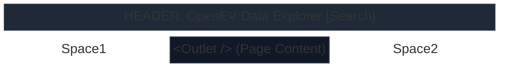

### Mobile Structure

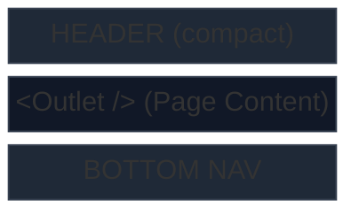

### Header Specs

| Property   | Value                                                     |
| ---------- | --------------------------------------------------------- |
| Height     | `64px` (desktop), `56px` (mobile)                         |
| Background | `--bg-surface-1` with `backdrop-filter: blur(12px)`       |
| Border     | `1px solid var(--border-subtle)` bottom                   |
| Position   | `sticky`, `top: 0`                                        |
| Z-Index    | `--z-sticky`                                              |
| Logo Font  | `--text-lg`, `--weight-bold`, `--text-primary`            |
| Logo Icon  | `⚡` or custom SVG, `--text-accent`                       |
| Padding    | `0 var(--space-6)` (desktop), `0 var(--space-4)` (mobile) |

### Bottom Navigation (Mobile Only)

| Property       | Value                                               |
| -------------- | --------------------------------------------------- |
| Height         | `56px`                                              |
| Background     | `--bg-surface-1` with `backdrop-filter: blur(12px)` |
| Border         | `1px solid var(--border-subtle)` top                |
| Position       | `fixed`, `bottom: 0`                                |
| Z-Index        | `--z-sticky`                                        |
| Icon Size      | `--icon-lg` (`24px`)                                |
| Label Font     | `--text-xs`, `--weight-medium`                      |
| Active Color   | `--text-accent`                                     |
| Inactive Color | `--text-tertiary`                                   |

---

## Home Page

**Route**: `/`
**Component**: `HomePage`
**Reference**: [A01 Desktop](reference/A01-home-page.png) · [M01 Mobile](reference/M01-mobile-home-page.png)

### Desktop Layout

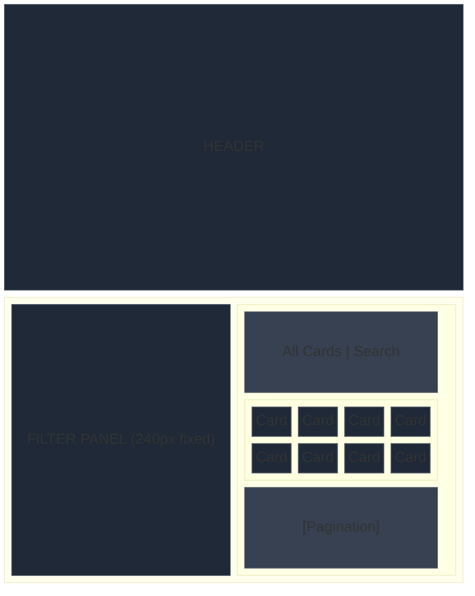

### Mobile Layout

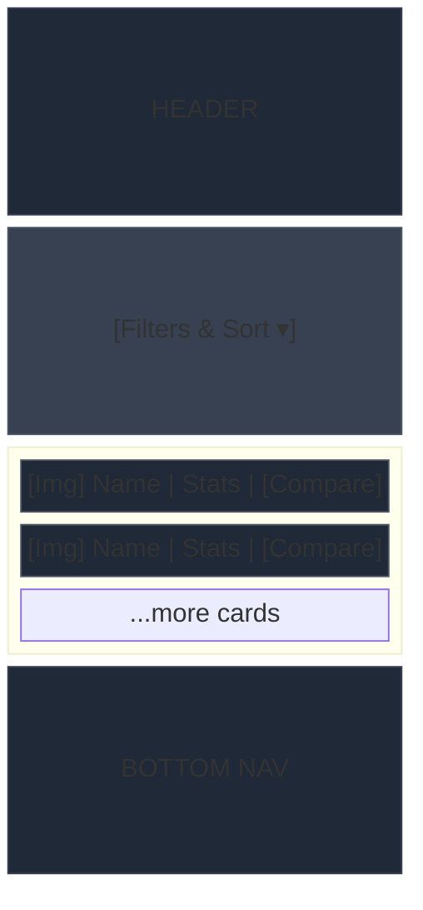

### Page Component Hierarchy

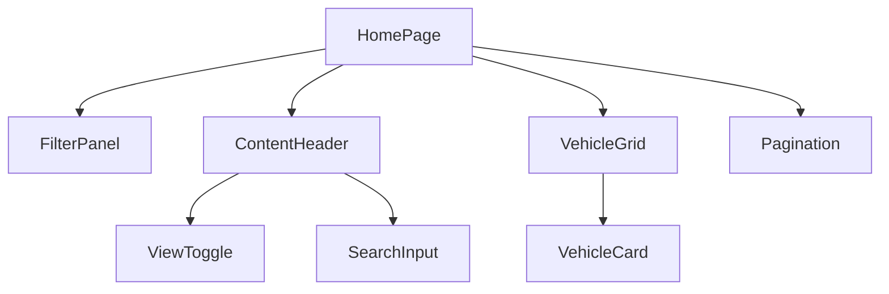

### Spec Details

| Property             | Desktop                                           | Mobile                      |
| -------------------- | ------------------------------------------------- | --------------------------- |
| Main layout          | `display: grid; grid-template-columns: 240px 1fr` | Single column               |
| Content area padding | `--space-6`                                       | `--space-4`                 |
| Card grid gap        | `--space-6`                                       | `--space-4`                 |
| Grid columns         | `repeat(auto-fill, minmax(240px, 1fr))`           | `1fr`                       |
| Secondary search     | Top-right of content area                         | Hidden (uses header search) |
| Filter position      | Sticky sidebar                                    | Collapsible at top          |

### Comparison Overlay (Active)

**Reference**: [A02 Desktop](reference/A02-home-page-compare-open.png) · [M02 Mobile](reference/M02-mobile-home-page-compare-open.png)

When the user opens the comparison view from the Home Page:

**Desktop**: A panel slides in from the right side, overlaying ~40% of the viewport width. The card grid content is visible but dimmed behind the panel.

**Mobile**: Full-screen overlay replacing the card list. The comparison panel takes 100% of the viewport with a "Close" button at top-right.

| Property     | Desktop                             | Mobile                                |
| ------------ | ----------------------------------- | ------------------------------------- |
| Panel width  | `~40vw`, min `380px`                | `100vw`                               |
| Animation    | `slide-in-right`, `--duration-slow` | `slide-in-right` or full opacity fade |
| Overlay bg   | `hsla(0,0%,0%,0.4)` behind panel    | None (full takeover)                  |
| Close button | `×` ghost button, top-right         | "Close" text button, top-right        |

---

## Vehicle Detail Page

**Route**: `/vehicle/:code`
**Component**: `VehicleDetailPage`
**Reference**: [A03 Desktop](reference/A03-view-one-vehicle.png) · [M03 Mobile](reference/M03-mobile-view-one-vehicle.png)

### Desktop Layout

```mermaid
block-beta
  columns 4
  Header["HEADER"]:4
  Sidebar["Sidebar"]:1
  Main["Main Content"]:3

  block:SidebarContent
    Back["← Back"]:1
    Image["[Vehicle Image]"]:1
    Highlights["Highlights List"]:1
    Technology["Technology"]:1
  end

  block:MainContent
    Title["Make Model Trim"]:1
    Tabs["Overview | Charging | Range | Specs"]:1
    Pills["Price | Range | Battery | 0-100"]:1
    block:Charts
        columns 2
        Chart1["Charging Curve"]:1
        Chart2["Range Estimates"]:1
    end
  end

  style Header fill:#1f2937,stroke:#374151,color:#fff
  style Sidebar fill:#1f2937,stroke:#374151,color:#fff
  style Main fill:#111827,stroke:#374151,color:#fff
```

### Mobile Layout

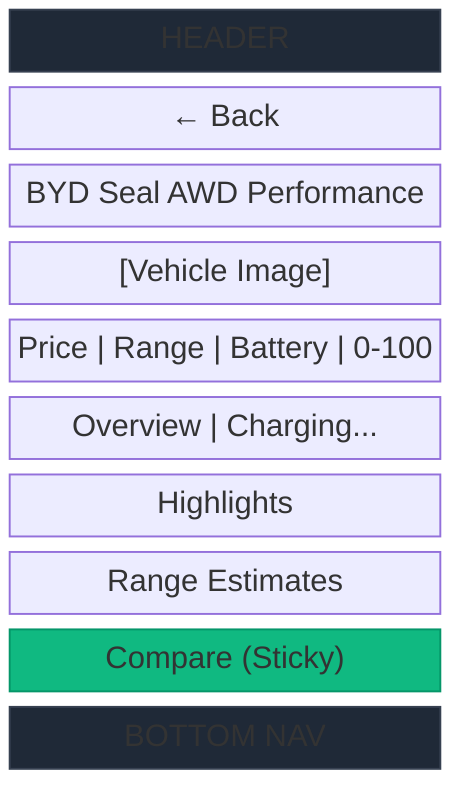

### Page Component Hierarchy

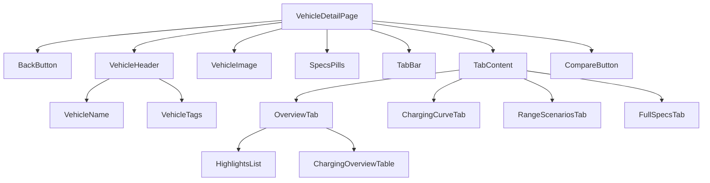

> [!IMPORTANT]
> **Data-driven tab visibility**: The tab bar only renders tabs whose underlying data exists for the current vehicle. The Overview tab is always present. Charging Curve requires `charging.dc_charge_curve`. Range Scenarios requires `range.real_world[]`. Full Specs is always present but each section within it collapses when empty. See [Data-Driven Rendering Principle](UI_COMPONENTS.md#data-driven-rendering-principle) for implementation details.

### Spec Details

| Property         | Desktop                             | Mobile                     |
| ---------------- | ----------------------------------- | -------------------------- |
| Layout           | 2-column: sidebar 280px + main area | Single column              |
| Sidebar bg       | `--bg-surface-1`                    | —                          |
| Image position   | Sidebar, centered                   | Full width, below title    |
| Image max height | `200px`                             | `200px`                    |
| Spec pills       | Horizontal row in main area         | Horizontal scroll          |
| Tab bar position | Below spec pills in main            | Below spec pills           |
| Charts layout    | Side by side (2 cols)               | Stacked vertically         |
| Compare button   | Top-right area, ghost style         | Sticky bottom, primary CTA |

---

## Compare Page

**Route**: `/compare`
**Component**: `ComparePage`

The standalone Compare Page provides a full-page comparison experience. This differs from the comparison panel overlay on the Home Page.

### Layout

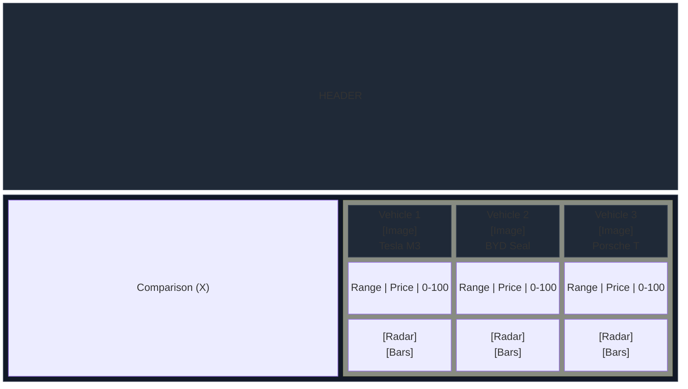

### Comparison Data Sections

All comparison rows are **data-driven**. A row only renders if at least one of the compared vehicles has data for that field. If a vehicle is missing a field that others have, display "—" in that cell. See [rendering rules](UI_COMPONENTS.md#rendering-rules).

1. **Key Metrics Table**: Range, Price, 0-100 km/h, Battery — rows filtered by data availability
2. **Radar Charts**: Only shown if enough metrics exist for a meaningful polygon (≥ 3 axes)
3. **Efficiency Bars**: Only shown if `efficiency.energy_consumption_wh_per_km` exists for at least one vehicle
4. **Charging Comparison**: AC max power, DC max power, architecture — from required `charging` object

### Spec Details

| Property          | Value                                                       |
| ----------------- | ----------------------------------------------------------- |
| Max vehicles      | 3                                                           |
| Column min width  | `200px` (desktop), `160px` (mobile)                         |
| Column header bg  | `--bg-glass`                                                |
| Row border        | `--border-subtle`                                           |
| Best value        | `--text-accent`, `--weight-bold`                            |
| Radar chart size  | `160px × 160px` (desktop), `120px × 120px` (mobile)         |
| Radar colors      | `--chart-cyan`, `--chart-green`, `--chart-teal` per vehicle |
| Remove button (×) | `ghost` button, top-right of column header                  |

---

## Not Found Page

**Route**: `*`
**Component**: `NotFoundPage`

### Layout

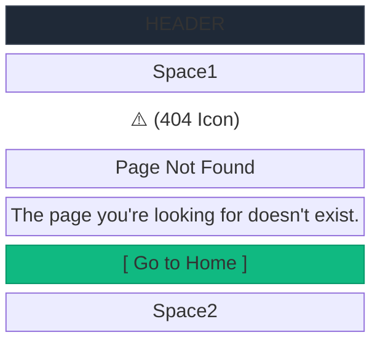

### Specs

| Property   | Value                                 |
| ---------- | ------------------------------------- |
| Layout     | Flex column, centered both axes       |
| Min height | `calc(100vh - header height)`         |
| Icon       | `--icon-xl` (32px), `--color-warning` |
| Title      | `--text-3xl`, `--weight-bold`         |
| Message    | `--text-base`, `--text-secondary`     |
| Button     | `primary` variant, `lg` size          |

---

## Loading and Error States

### Initial Loading (Full Page)

When the application first loads and fetches the vehicle dataset:

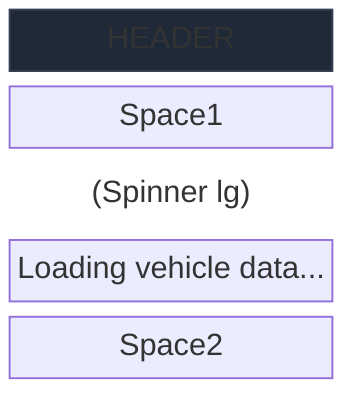

### Skeleton Loading (Cards)

While data is being processed/filtered, card skeletons maintain layout stability:

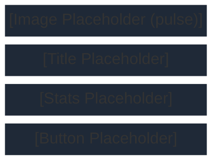

### Skeleton Specs

| Property          | Value                                                                     |
| ----------------- | ------------------------------------------------------------------------- |
| Background        | `--bg-surface-2`                                                          |
| Animated gradient | `linear-gradient(90deg, transparent, hsla(210,20%,30%,0.2), transparent)` |
| Animation         | `pulse` keyframe, `1.5s infinite`                                         |
| Border radius     | Matches target element                                                    |
| Height            | Matches expected content height                                           |

### Error State (API Failure)

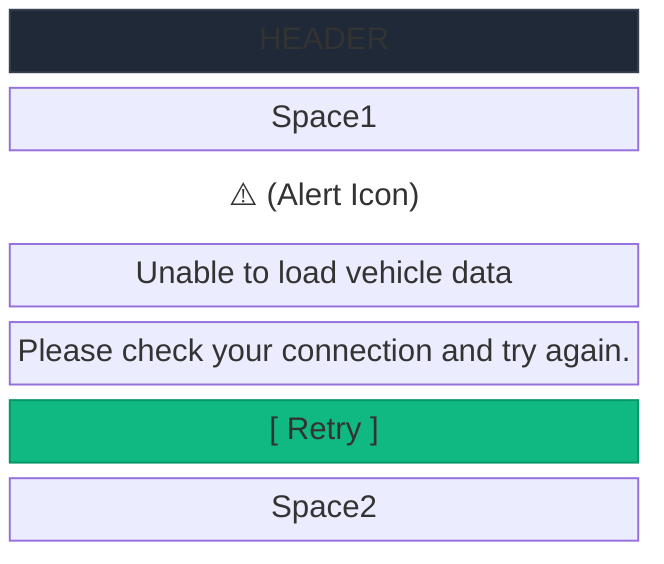

| Property     | Value                             |
| ------------ | --------------------------------- |
| Component    | `ErrorFallback` from `shared/ui/` |
| Icon         | Alert triangle, `--color-warning` |
| Title        | `--text-xl`, `--weight-semibold`  |
| Message      | `--text-base`, `--text-secondary` |
| Retry button | `primary` variant                 |
