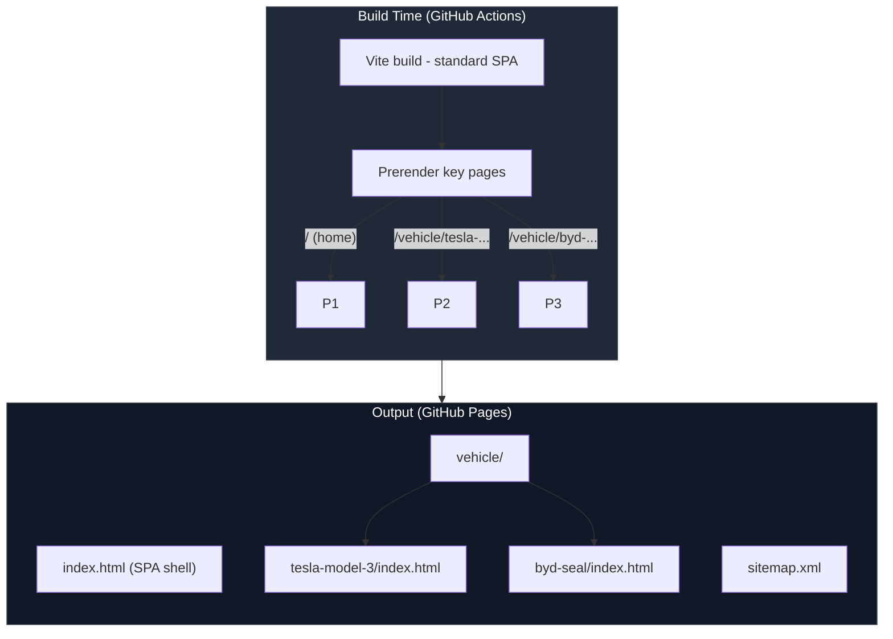

# SEO Strategy

This document outlines the SEO approach for maximizing discoverability of the OpenEV Data UI on search engines and social media platforms.

### Related Documents

| Document                                            | Scope                             |
| --------------------------------------------------- | --------------------------------- |
| [Architecture](ARCHITECTURE.md)                     | Deployment and routing setup      |
| [Task 0009](../TODO/tasks/0009-seo-optimization.md) | Detailed implementation checklist |

## Table of Contents

- [SEO Challenges for SPAs](#seo-challenges-for-spas)
- [Core Strategy](#core-strategy)
- [Technical Implementation](#technical-implementation)
- [Content Strategy](#content-strategy)
- [Performance Optimization](#performance-optimization)
- [Measurement](#measurement)

---

## SEO Challenges for SPAs

Single-Page Applications (SPAs) face inherent SEO challenges:

1. **JavaScript-dependent content**: Crawlers may not execute JS or wait for async data
2. **No unique HTML per route**: All routes serve the same `index.html`
3. **Delayed indexing**: Google can index JS sites but takes longer
4. **Social media crawlers**: Facebook/Twitter don't execute JS → blank previews

### How We Solve This

1. **Static Prerendering**: Generate HTML snapshots for critical pages
2. **Dynamic meta tags**: Use `react-helmet-async` for per-page metadata
3. **Structured data**: JSON-LD schemas for rich search results
4. **Performance**: Excellent Core Web Vitals scores boost rankings

---

## Core Strategy

### 1. Hybrid Rendering Approach



**Result**: Crawlers see full HTML. Users get instant hydration. Best of both worlds.

---

## Technical Implementation

### Meta Tags Structure

Every page must have:

```tsx
// Example: Vehicle Detail Page
import { Helmet } from "react-helmet-async";

export function VehicleDetailPage({ vehicle }: Props) {
  const title = `${vehicle.make.name} ${vehicle.model.name} ${vehicle.year} - Full Specs`;
  const description = `Complete technical specs: ${vehicle.range.rated[0].range_km}km range, ${vehicle.battery.pack_capacity_kwh_net}kWh battery. Charging curves, dimensions, performance.`;
  const image = vehicle.images?.exterior_url || DEFAULT_OG_IMAGE;
  const url = `https://open-ev-data.github.io/open-ev-data-ui/vehicle/${vehicle.unique_code}`;

  return (
    <>
      <Helmet>
        {/* Primary Meta Tags */}
        <title>{title}</title>
        <meta name="title" content={title} />
        <meta name="description" content={description} />
        <link rel="canonical" href={url} />

        {/* Open Graph / Facebook */}
        <meta property="og:type" content="product" />
        <meta property="og:url" content={url} />
        <meta property="og:title" content={title} />
        <meta property="og:description" content={description} />
        <meta property="og:image" content={image} />
        <meta property="og:site_name" content="OpenEV Data" />

        {/* Twitter */}
        <meta name="twitter:card" content="summary_large_image" />
        <meta name="twitter:url" content={url} />
        <meta name="twitter:title" content={title} />
        <meta name="twitter:description" content={description} />
        <meta name="twitter:image" content={image} />

        {/* Structured Data */}
        <script type="application/ld+json">
          {JSON.stringify({
            "@context": "https://schema.org",
            "@type": "Product",
            name: `${vehicle.make.name} ${vehicle.model.name}`,
            brand: {
              "@type": "Brand",
              name: vehicle.make.name,
            },
            model: vehicle.model.name,
            offers: {
              "@type": "Offer",
              price: vehicle.pricing?.msrp?.[0]?.amount,
              priceCurrency: vehicle.pricing?.msrp?.[0]?.currency,
              availability: "https://schema.org/InStock",
            },
            description: description,
            image: image,
          })}
        </script>
      </Helmet>

      {/* Page content... */}
    </>
  );
}
```

### Structured Data Schemas

Implement these schema.org types:

| Page           | Schema Type            | Priority |
| -------------- | ---------------------- | -------- |
| Home           | WebSite + SearchAction | High     |
| Vehicle Detail | Product                | Critical |
| Compare        | ItemList               | Medium   |
| All pages      | BreadcrumbList         | Medium   |
| Footer         | Organization           | Low      |

---

## Content Strategy

### Keyword Research

Primary keywords (high volume, medium competition):

- "electric vehicle specs"
- "EV battery comparison"
- "electric car charging speed"
- "{brand} {model} specifications"

Long-tail keywords (low competition, high intent):

- "{brand} {model} {year} real world range"
- "compare {vehicle1} vs {vehicle2}"
- "{brand} {model} DC charging curve"

### On-Page Content

Each vehicle page should include:

1. **Descriptive paragraph** (150-200 words):

   ```
   The {Make} {Model} is a {type} electric vehicle introduced in {year}.
   With a {battery}kWh battery and {range}km WLTP range, it targets the
   {segment} market. Key features include {highlights}...
   ```

2. **Semantic HTML**:
   - One `<h1>`: Vehicle name
   - `<h2>`: Section headings (Overview, Charging, Range, Specs)
   - `<article>`: Wrap main content
   - `<aside>`: Comparison panel

3. **Internal linking**:
   - "Similar vehicles" section (same make, similar range)
   - Breadcrumbs: Home → {Type} → {Make} → {Model}

---

## Performance Optimization

SEO in 2024+ is heavily influenced by Core Web Vitals:

### Target Metrics

| Metric  | Target  | Current | Strategy                                        |
| ------- | ------- | ------- | ----------------------------------------------- |
| **LCP** | < 2.5s  | TBD     | Optimize images, preload fonts, code splitting  |
| **INP** | < 200ms | TBD     | Debounce filters, virtualize lists, memoization |
| **CLS** | < 0.1   | TBD     | Reserve image space, avoid dynamic injection    |

### Optimization Checklist

- [x] Lazy load images (`loading="lazy"`)
- [x] Modern image formats (WebP with JPEG fallback)
- [x] Responsive images (`srcset`, `sizes`)
- [x] Preload critical resources (fonts, initial data)
- [x] Code splitting by route (React.lazy)
- [x] Minimize third-party scripts
- [x] Service Worker for offline/caching (optional, future enhancement)

---

## Measurement

### Tools

1. **Google Search Console** (primary):
   - Submit sitemap
   - Monitor indexing status (Coverage report)
   - Track search queries and impressions
   - Check mobile usability

2. **PageSpeed Insights**:
   - Core Web Vitals
   - Performance score
   - Run weekly to catch regressions

3. **Plausible Analytics**:
   - Privacy-friendly, no cookies
   - Track: page views, popular vehicles, referrers
   - Setup custom goals: "Compare button click", "Share"

4. **Bing Webmaster Tools**:
   - Submit sitemap
   - Monitor Bing indexing (5-10% of traffic)

### Success Metrics (3 months post-launch)

| Metric                     | Target                       |
| -------------------------- | ---------------------------- |
| Indexed pages              | > 300 (out of 400+ vehicles) |
| Organic search impressions | > 1000/month                 |
| Average position           | < 20 (top 2 pages)           |
| Click-through rate         | > 3%                         |
| PageSpeed score            | > 90 (mobile & desktop)      |
| Lighthouse SEO             | 100                          |

---

## Advanced Techniques (Future Enhancements)

### 1. Dynamic Rendering (Conditional Serving)

Detect crawlers and serve prerendered HTML:

```typescript
// Cloudflare Worker or similar
const CRAWLER_USER_AGENTS =
  /googlebot|bingbot|slurp|duckduckbot|baiduspider|yandex|facebookexternalhit|twitterbot|rogerbot|linkedinbot|embedly|quora link preview|showyoubot|outbrain|pinterest|slackbot|vkShare|W3C_Validator/i;

export async function handleRequest(request: Request) {
  const userAgent = request.headers.get("user-agent") || "";

  if (CRAWLER_USER_AGENTS.test(userAgent)) {
    // Serve prerendered HTML
    return fetch(`${PRERENDER_SERVICE}/${request.url}`);
  }

  // Serve SPA
  return fetch(request);
}
```

### 2. AMP (Accelerated Mobile Pages)

Create AMP versions of top vehicle pages for instant mobile loading.

### 3. RSS Feed

Generate RSS feed of newly added vehicles for blog/news site syndication.

---

## Common Pitfalls to Avoid

❌ **Don't**:

- Use hash-based routing (`#/vehicle/123`) — not SEO-friendly
- Block crawlers with aggressive `robots.txt`
- Forget canonical URLs → duplicate content penalties
- Ignore Open Graph → poor social sharing
- Overuse keywords → keyword stuffing penalty

✅ **Do**:

- Use history-based routing (`/vehicle/123`)
- Allow all crawlers (`User-agent: *\nAllow: /`)
- Set canonical on every page
- Test social previews before launch
- Write natural, descriptive content
