```mermaid
block-beta
  columns 1
  block:Group
    columns 2
    Label["Label"]
    Value["Value"]
  end
  block:Slider
    columns 5
    Filled["━━━━━━"]:3
    Thumb["(thumb)"]:1
    Empty["─────"]:1
  end

  style Label fill:none,stroke:none
  style Value fill:none,stroke:none
  style Filled fill:none,stroke:none,color:#10b981
  style Thumb fill:#10b981,stroke:#fff,stroke-width:2px,color:#fff
  style Empty fill:none,stroke:none,color:#4b5563
```

```mermaid
block-beta
  columns 4
  Tab1["Overview"]:1
  Tab2["Charging Curve"]:1
  Tab3["Range Scenarios"]:1
  Tab4["Full Specs"]:1

  ActiveLine["━━━━━━━━"]:1
  Inactive1["   "]:1
  Inactive2["   "]:1
  Inactive3["   "]:1

  style Tab1 fill:none,stroke:none,color:#fff
  style Tab2 fill:none,stroke:none,color:#9ca3af
  style Tab3 fill:none,stroke:none,color:#9ca3af
  style Tab4 fill:none,stroke:none,color:#9ca3af
  style ActiveLine fill:none,stroke:none,color:#10b981
  style Inactive1 fill:none,stroke:none
  style Inactive2 fill:none,stroke:none
  style Inactive3 fill:none,stroke:none
```

# UI Components

This document defines the visual specifications, anatomy, variants, and interaction states for all UI components. Each component maps to a file in `src/shared/ui/` or `src/entities/*/ui/`. Visual tokens (colors, spacing, typography) are defined in [DESIGN_SYSTEM.md](DESIGN_SYSTEM.md) and not duplicated here. Responsive behavior is defined in [RESPONSIVE_STRATEGY.md](RESPONSIVE_STRATEGY.md).

### Related Documents

| Document                                           | Scope                                                 |
| -------------------------------------------------- | ----------------------------------------------------- |
| [Design System](DESIGN_SYSTEM.md)                  | All CSS custom property tokens referenced here        |
| [Responsive Strategy](RESPONSIVE_STRATEGY.md)      | Breakpoints and component viewport adaptations        |
| [Page Layouts](PAGE_LAYOUTS.md)                    | How these components compose into pages               |
| [Schema Reference](schema/reference_20260216.json) | Data field definitions — drives conditional rendering |

## Table of Contents

- [UI Components](#ui-components)
    - [Related Documents](#related-documents)
  - [Table of Contents](#table-of-contents)
  - [Design Principles](#design-principles)
  - [Data-Driven Rendering Principle](#data-driven-rendering-principle)
    - [Schema Field Classification](#schema-field-classification)
      - [Always Available (Required by Schema)](#always-available-required-by-schema)
      - [Conditionally Rendered (Optional by Schema)](#conditionally-rendered-optional-by-schema)
    - [Rendering Rules](#rendering-rules)
    - [Implementation Pattern](#implementation-pattern)
  - [Shared UI Components](#shared-ui-components)
    - [Button](#button)
      - [Variants](#variants)
      - [Sizes](#sizes)
      - [States](#states)
    - [Input](#input)
      - [Anatomy](#anatomy)
      - [Specs](#specs)
    - [SearchBar](#searchbar)
      - [Anatomy](#anatomy-1)
      - [Specs](#specs-1)
    - [Card](#card)
      - [Variants](#variants-1)
      - [Specs](#specs-2)
    - [Badge](#badge)
      - [Variants](#variants-2)
      - [Specs](#specs-3)
    - [Slider](#slider)
      - [Anatomy](#anatomy-2)
      - [Specs](#specs-4)
    - [Checkbox](#checkbox)
      - [States](#states-1)
      - [Specs](#specs-5)
    - [Select](#select)
      - [Specs](#specs-6)
    - [Spinner](#spinner)
      - [Specs](#specs-7)
    - [Modal](#modal)
      - [Specs](#specs-8)
    - [Pagination](#pagination)
      - [Specs](#specs-9)
    - [Tabs](#tabs)
      - [Anatomy](#anatomy-3)
      - [Specs](#specs-10)
    - [ErrorFallback](#errorfallback)
      - [Specs](#specs-11)
  - [Entity Components](#entity-components)
    - [VehicleCard](#vehiclecard)
      - [Desktop Anatomy (Grid)](#desktop-anatomy-grid)
      - [Mobile Anatomy (List)](#mobile-anatomy-list)
      - [Specs](#specs-12)
      - [Vehicle Image Styling](#vehicle-image-styling)
    - [VehicleSpecsTable](#vehiclespecstable)
      - [Anatomy](#anatomy-4)
      - [Specs](#specs-13)
  - [Feature Components](#feature-components)
    - [SearchBar (Feature)](#searchbar-feature)
      - [Behavior](#behavior)
    - [FilterPanel](#filterpanel)
      - [Desktop Anatomy](#desktop-anatomy)
      - [Specs](#specs-14)
    - [CompareTable](#comparetable)
      - [Desktop Anatomy (Overlay Panel)](#desktop-anatomy-overlay-panel)
      - [Specs](#specs-15)
  - [Interaction States](#interaction-states)
  - [Accessibility Requirements](#accessibility-requirements)

---

## Design Principles

1. **Dark-surface native**: components are designed for dark backgrounds; avoid light-bg assumptions
2. **Token-only styling**: all visual values reference CSS Custom Properties from `tokens.css` (see [Design System](DESIGN_SYSTEM.md))
3. **State-complete**: every interactive component defines `:hover`, `:focus-visible`, `:active`, and `:disabled` states
4. **Compose, don't configure**: prefer small, composable components over monolithic ones with many boolean props (SRP / SOLID)
5. **Data-driven rendering**: components only render fields that exist in the vehicle data — see [Data-Driven Rendering Principle](#data-driven-rendering-principle) below

---

## Data-Driven Rendering Principle

The vehicle schema ([reference_20260216.json](schema/reference_20260216.json)) defines **required** and **optional** fields. Components must adapt intelligently to what data each vehicle actually has, following SOLID's Single Responsibility (each component renders one concern) and DRY (one utility for null-checking, reused everywhere).

### Schema Field Classification

#### Always Available (Required by Schema)

These fields are guaranteed to exist on every vehicle and can be rendered unconditionally.

| Field            | Path                          | UI Usage                                         |
| ---------------- | ----------------------------- | ------------------------------------------------ |
| Make             | `make.name`                   | Card title, detail header, search                |
| Model            | `model.name`                  | Card title, detail header, search                |
| Year             | `year`                        | Card subtitle, badges, filters                   |
| Trim             | `trim.name`                   | Card subtitle, detail header                     |
| Vehicle Type     | `vehicle_type`                | Filter checkbox, badge                           |
| Drivetrain       | `powertrain.drivetrain`       | Filter checkbox, spec row                        |
| Rated Range      | `range.rated[].range_km`      | Card stat, spec pill, comparison row             |
| Charging (AC/DC) | `charging.ac` / `charging.dc` | Spec rows, charging tab                          |
| Battery          | `battery.*`                   | Spec pill (when `pack_capacity_kwh_net` present) |
| Sources          | `sources[]`                   | Detail page footer, citations                    |

#### Conditionally Rendered (Optional by Schema)

These fields may or may not exist. Components must **check for presence before rendering**.

| Field            | Path                       | Render If Present                         |
| ---------------- | -------------------------- | ----------------------------------------- |
| Variant          | `variant`                  | Sub-label on card, detail header          |
| Markets          | `markets[]`                | Market availability filter, badges        |
| Availability     | `availability`             | Status badge (production/discontinued)    |
| Body             | `body`                     | Detail specs: style, doors, seats, Cd     |
| Dimensions       | `dimensions`               | Detail specs: L×W×H, wheelbase            |
| Weights          | `weights`                  | Detail specs: curb weight, payload        |
| Capacity         | `capacity`                 | Detail specs: cargo, frunk, towing        |
| V2X              | `v2x`                      | Highlights: V2L/V2H/V2G badges            |
| Efficiency       | `efficiency`               | Spec row: Wh/km, MPGe                     |
| Performance      | `performance`              | Card stat (0-100), detail specs           |
| DC Charge Curve  | `charging.dc_charge_curve` | Charging Curve tab/chart                  |
| Charging Times   | `charging.charging_time`   | Charging tab data                         |
| Real-World Range | `range.real_world[]`       | Range Scenarios tab/chart                 |
| Pricing          | `pricing.msrp[]`           | Spec pill, comparison row                 |
| Wheels/Tires     | `wheels_tires`             | Detail specs section                      |
| Software         | `software`                 | Detail: OTA badge, OS info                |
| Links            | `links`                    | External links (manufacturer, spec sheet) |
| Images           | `images`                   | Vehicle image, interior image             |
| Metadata         | `metadata`                 | Internal only, not user-facing            |

### Rendering Rules

1. **Never show empty labels**: if `performance.acceleration_0_100_kmh_s` is `undefined`/`null`, the entire "0-100 km/h" stat pill must not render — not even with a dash or "N/A"
2. **Section collapse**: if an entire optional section has no data (e.g., all `dimensions` fields are missing), the section header and container must not render
3. **Comparison row skip**: in the CompareTable, if none of the compared vehicles have a given field, the entire row is omitted. If some have it and others don't, show "—" for vehicles without the data
4. **Filter adaptability**: filter options (e.g., Vehicle Type checkboxes) should only show values that actually exist in the loaded dataset, not all possible enum values
5. **Tab visibility**: detail page tabs (Charging Curve, Range Scenarios) only appear if the vehicle has `dc_charge_curve` or `real_world` range data respectively

### Implementation Pattern

A single reusable utility in `shared/lib/` handles field presence checking, keeping the codebase DRY:

```tsx
// shared/lib/data-presence.ts

/** Returns true if value is not null, undefined, or empty array/object */
export function hasData<T>(value: T | null | undefined): value is T {
  if (value === null || value === undefined) return false;
  if (Array.isArray(value)) return value.length > 0;
  if (typeof value === "object") return Object.keys(value).length > 0;
  return true;
}

/** Renders children only if value has data. Passes validated value to render. */
export function DataField<T>({
  value,
  render,
}: {
  value: T | null | undefined;
  render: (data: T) => React.ReactNode;
}) {
  return hasData(value) ? <>{render(value)}</> : null;
}
```

Usage in components:

```tsx
// Only render the 0-100 stat if performance data exists
<DataField
  value={vehicle.performance?.acceleration_0_100_kmh_s}
  render={(val) => <SpecPill label="0-100 km/h" value={`${val}s`} />}
/>;

// Only render Charging Curve tab if data exists
{
  hasData(vehicle.charging?.dc_charge_curve) && (
    <Tab label="Charging Curve">
      <ChargingCurveChart data={vehicle.charging.dc_charge_curve} />
    </Tab>
  );
}
```

> [!IMPORTANT]
> The `hasData` utility is the **single source of truth** for field presence checks. All components must use it instead of inline `!== undefined` checks. This ensures consistent behavior and a single place to update if null-checking logic evolves.

---

## Shared UI Components

### Button

Reusable button with multiple variants and sizes.

#### Variants

| Variant     | Background                | Border             | Text               | Usage                            |
| ----------- | ------------------------- | ------------------ | ------------------ | -------------------------------- |
| `primary`   | `--gradient-cta`          | none               | `--text-on-cta`    | Primary actions (Compare, Apply) |
| `secondary` | `transparent`             | `--border-primary` | `--text-accent`    | Secondary actions (Back, Cancel) |
| `ghost`     | `transparent`             | none               | `--text-secondary` | Tertiary actions (Close, Clear)  |
| `danger`    | `hsla(0, 75%, 55%, 0.15)` | `--color-error`    | `--color-error`    | Destructive actions (Remove)     |

#### Sizes

| Size | Height | Padding (horizontal) | Font Size     | Border Radius  |
| ---- | ------ | -------------------- | ------------- | -------------- |
| `sm` | `32px` | `--space-3`          | `--text-sm`   | `--radius-md`  |
| `md` | `40px` | `--space-4`          | `--text-base` | `--radius-md`  |
| `lg` | `48px` | `--space-6`          | `--text-md`   | `--radius-2xl` |

#### States


- **Hover**: `filter: brightness(1.1)`, add `--glow-cta` shadow
- **Active**: `transform: scale(0.98)`
- **Focus-visible**: `outline: 2px solid var(--state-focus-ring)`, `outline-offset: 2px`
- **Disabled**: `opacity: var(--state-disabled-opacity)`, `pointer-events: none`

---

### Input

Text input field with support for adornments (icons, buttons).

#### Anatomy


#### Specs

| Property          | Value                                                    |
| ----------------- | -------------------------------------------------------- |
| Background        | `--bg-input`                                             |
| Border            | `1px solid var(--border-default)`                        |
| Border (focus)    | `1px solid var(--border-primary)`                        |
| Border Radius     | `--radius-2xl` (search bar), `--radius-md` (form fields) |
| Height            | `44px`                                                   |
| Padding           | `--space-3` vertical, `--space-4` horizontal             |
| Text Color        | `--text-primary`                                         |
| Placeholder Color | `--text-tertiary`                                        |
| Font Size         | `--text-base`                                            |

---

### SearchBar

The global search component in the header.

#### Anatomy


#### Specs

| Property      | Value                                           |
| ------------- | ----------------------------------------------- |
| Background    | `--bg-input`                                    |
| Border        | `1px solid var(--border-subtle)`                |
| Border Radius | `--radius-2xl`                                  |
| Width         | `clamp(280px, 50vw, 600px)`                     |
| Height        | `44px`                                          |
| Icon (left)   | Search icon, `--icon-md`, `--text-tertiary`     |
| Icon (right)  | Microphone icon, `--icon-md`, `--text-tertiary` |

---

### Card

Generic container component with glassmorphism surface.

#### Variants

| Variant       | Background            | Border                                          | Shadow                                       |
| ------------- | --------------------- | ----------------------------------------------- | -------------------------------------------- |
| `default`     | `--bg-surface-2`      | `--border-subtle`                               | `--shadow-md`                                |
| `glass`       | `--bg-glass`          | `--border-subtle`                               | `--shadow-md`, `backdrop-filter: blur(12px)` |
| `highlighted` | `--bg-card-highlight` | `--border-primary`                              | `--glow-primary`                             |
| `interactive` | `--bg-surface-2`      | `--border-subtle` → `--border-primary` on hover | `--shadow-md` → `--glow-primary` on hover    |

#### Specs

| Property      | Value                      |
| ------------- | -------------------------- |
| Border Radius | `--radius-lg`              |
| Padding       | `--space-4` to `--space-6` |
| Transition    | `var(--transition-all)`    |

---

### Badge

Small informational tag for categories and labels.

#### Variants

| Variant   | Background                  | Text               |
| --------- | --------------------------- | ------------------ |
| `default` | `--color-primary-muted`     | `--text-accent`    |
| `success` | `hsla(145, 65%, 45%, 0.15)` | `--color-success`  |
| `warning` | `hsla(40, 90%, 55%, 0.15)`  | `--color-warning`  |
| `neutral` | `hsla(210, 15%, 50%, 0.15)` | `--text-secondary` |

#### Specs

| Property       | Value                                        |
| -------------- | -------------------------------------------- |
| Padding        | `--space-1` vertical, `--space-2` horizontal |
| Border Radius  | `--radius-sm`                                |
| Font Size      | `--text-xs`                                  |
| Font Weight    | `--weight-medium`                            |
| Text Transform | `uppercase`                                  |
| Letter Spacing | `--tracking-wider`                           |

---

### Slider

Range selector for filter values (Range, Battery, Charging Power, 0-100 km/h).

#### Anatomy



#### Specs

| Property               | Value                                             |
| ---------------------- | ------------------------------------------------- |
| Track Height           | `4px`                                             |
| Track Color (unfilled) | `hsla(210, 20%, 30%, 0.4)`                        |
| Track Color (filled)   | `--gradient-cta`                                  |
| Track Radius           | `--radius-full`                                   |
| Thumb Size             | `16px`                                            |
| Thumb Color            | `--color-primary`                                 |
| Thumb Border           | `2px solid var(--bg-surface-1)`                   |
| Thumb Shadow           | `--glow-primary`                                  |
| Label Font             | `--text-sm`, `--weight-medium`, `--text-primary`  |
| Value Font             | `--text-sm`, `--weight-semibold`, `--text-accent` |

---

### Checkbox

Filter checkboxes with consistent dark-theme styling.

#### States

| State         | Box Background    | Check Color                    | Border                         |
| ------------- | ----------------- | ------------------------------ | ------------------------------ |
| Unchecked     | `transparent`     | —                              | `--border-default`             |
| Checked       | `--color-primary` | `--text-on-cta` or `--bg-base` | `--color-primary`              |
| Indeterminate | `--color-primary` | `--bg-base` (dash)             | `--color-primary`              |
| Disabled      | `transparent`     | —                              | `--border-subtle`, 40% opacity |

#### Specs

| Property      | Value                         |
| ------------- | ----------------------------- |
| Size          | `18px × 18px`                 |
| Border Radius | `--radius-sm`                 |
| Label Gap     | `--space-2`                   |
| Label Font    | `--text-sm`, `--text-primary` |

---

### Select

Dropdown selector for filter categories.

#### Specs

| Property            | Value                                            |
| ------------------- | ------------------------------------------------ |
| Background          | `--bg-surface-2`                                 |
| Border              | `--border-default`                               |
| Border Radius       | `--radius-md`                                    |
| Height              | `40px`                                           |
| Dropdown Background | `--bg-surface-3`                                 |
| Dropdown Shadow     | `--shadow-lg`                                    |
| Option Hover        | `--state-hover` overlay                          |
| Option Selected     | `--color-primary-muted` bg, `--text-accent` text |

---

### Spinner

Loading indicator for data fetching states.

#### Specs

| Property         | Value                       |
| ---------------- | --------------------------- |
| Size (sm)        | `16px`                      |
| Size (md)        | `24px`                      |
| Size (lg)        | `40px`                      |
| Color            | `--color-primary`           |
| Animation        | `spin 0.8s linear infinite` |
| Secondary Circle | `--border-subtle`           |

---

### Modal

Overlay container used for the Comparison panel on desktop.

#### Specs

| Property           | Value                                           |
| ------------------ | ----------------------------------------------- |
| Overlay Background | `hsla(0, 0%, 0%, var(--opacity-overlay))`       |
| Surface Background | `--bg-surface-2`                                |
| Border             | `--border-subtle`                               |
| Border Radius      | `--radius-xl`                                   |
| Shadow             | `--shadow-xl`                                   |
| Max Width          | `900px` (comparison), `480px` (standard)        |
| Padding            | `--space-6` to `--space-8`                      |
| Enter Animation    | `slide-in-right` + `fade-in`, `--duration-slow` |
| Exit Animation     | reverse of enter                                |
| Z-Index            | `--z-modal`                                     |

---

### Pagination

Page navigation for the vehicle card grid.

#### Specs

| Property                   | Value                   |
| -------------------------- | ----------------------- |
| Button Size                | `36px × 36px`           |
| Button Background          | `transparent`           |
| Button Background (active) | `--color-primary-muted` |
| Button Border              | `--border-subtle`       |
| Button Border (active)     | `--border-primary`      |
| Text Color                 | `--text-secondary`      |
| Text Color (active)        | `--text-accent`         |
| Gap                        | `--space-1`             |

---

### Tabs

Horizontal tab switcher for vehicle detail sub-sections.

#### Anatomy



#### Specs

| Property         | Value                                          |
| ---------------- | ---------------------------------------------- |
| Tab Padding      | `--space-3` vertical, `--space-4` horizontal   |
| Active Indicator | `2px solid var(--color-primary)` bottom border |
| Active Text      | `--text-accent`, `--weight-semibold`           |
| Inactive Text    | `--text-secondary`, `--weight-medium`          |
| Hover Text       | `--text-primary`                               |
| Gap between tabs | `--space-6`                                    |

---

### ErrorFallback

Displayed when an Error Boundary catches an error.

#### Specs

| Property     | Value                                        |
| ------------ | -------------------------------------------- |
| Icon         | Alert circle, `--icon-xl`, `--color-warning` |
| Title Font   | `--text-xl`, `--weight-semibold`             |
| Message Font | `--text-base`, `--text-secondary`            |
| Retry Button | `primary` variant, `md` size                 |
| Layout       | Centered vertically and horizontally         |

---

## Entity Components

### VehicleCard

The primary vehicle display card used in the grid/list views.

#### Desktop Anatomy (Grid)


#### Mobile Anatomy (List)

```mermaid
block-beta
  columns 2
  Image["[Image]"]:1
  block:Content
    columns 1
    block:Header
      columns 2
      Title["Make Model"]
      Fav["♡"]
    end
    block:Stats
        columns 3
        S1["450 km"]
        S2["28.6 kWh"]
        S3["7.5s"]
    end
    Btn["Compare"]
  end

  style Image fill:#1f2937,stroke:none
  style Btn fill:#10b981,stroke:none,color:#fff
```



#### Specs

| Property          | Desktop                                             | Mobile                    |
| ----------------- | --------------------------------------------------- | ------------------------- |
| Background        | `--bg-surface-2`                                    | `--bg-surface-2`          |
| Border            | `--border-subtle`                                   | `--border-subtle`         |
| Border (hover)    | `--border-primary`                                  | —                         |
| Border (selected) | `--border-primary-strong` + `--glow-primary-strong` | `--border-primary-strong` |
| Border Radius     | `--radius-lg`                                       | `--radius-lg`             |
| Padding           | `--space-4`                                         | `--space-3`               |
| Image Height      | `140px`                                             | `80px`                    |
| Image Treatment   | `object-fit: contain`, subtle cyan tint filter      | Same                      |
| Grid Gap          | `--space-6`                                         | —                         |
| Card Animation    | `fade-in-up` with staggered delay                   | —                         |

#### Vehicle Image Styling

Vehicle images are treated with a subtle blue/cyan tint to match the dark UI aesthetic:

```css
.vehicleImage {
  filter: brightness(0.9) contrast(1.1) saturate(0.8);
  opacity: var(--opacity-image);
  transition: var(--transition-transform);
}

.vehicleImage:hover {
  transform: scale(1.05);
}
```

---

### VehicleSpecsTable

Key specs display in both the card and the detail page.

#### Anatomy


#### Specs

| Property      | Value                                                         |
| ------------- | ------------------------------------------------------------- |
| Value Font    | `--text-lg` or `--text-xl`, `--weight-bold`, `--text-primary` |
| Label Font    | `--text-xs`, `--weight-regular`, `--text-secondary`           |
| Container     | Horizontal flex, `gap: var(--space-4)`                        |
| Dividers      | `1px solid var(--border-subtle)` between items                |
| Background    | `--bg-surface-2` (subtle card-like wrapper)                   |
| Border Radius | `--radius-md`                                                 |
| Padding       | `--space-3` vertical, `--space-4` horizontal per item         |

---

## Feature Components

### SearchBar (Feature)

The global search component combining Input + autocomplete dropdown.

#### Behavior

1. User types → debounced search (300ms)
2. Results appear in dropdown overlay
3. Each result shows: vehicle image (mini), make + model, year
4. Click navigates to `/vehicle/:code`
5. `Escape` clears and closes dropdown

---

### FilterPanel

Sidebar filter panel visible on desktop, collapsible accordion on mobile.

#### Desktop Anatomy

```mermaid
block-beta
  columns 1
  Title["Filtering"]:1

  RangeLabel["Range (WLTP km) 500"]:1
  RangeSlider["●━━━━━━━○──"]:1

  BatteryLabel["Battery (kWh) 230"]:1
  BatterySlider["●━━━━━○────"]:1

  Check1["[ ] Market"]:1
  Check2["[x] Compared"]:1

  TypeLabel["Vehicle Type"]:1
  Check3["[ ] SUV"]:1
  Check4["[ ] Sedan"]:1

  style Title fill:none,stroke:none
  style RangeSlider fill:none,stroke:none,color:#10b981
  style BatterySlider fill:none,stroke:none,color:#10b981
```



#### Specs

| Property    | Desktop                      | Mobile                   |
| ----------- | ---------------------------- | ------------------------ |
| Width       | `240px` fixed                | Full width               |
| Background  | `--bg-surface-1`             | `--bg-surface-2`         |
| Border      | `--border-subtle` right edge | `--border-subtle` bottom |
| Padding     | `--space-5`                  | `--space-4`              |
| Section Gap | `--space-6`                  | `--space-5`              |
| Position    | Sticky, `top: header height` | Collapsible accordion    |

---

### CompareTable

Side-by-side vehicle comparison with data rows and visualizations.

#### Desktop Anatomy (Overlay Panel)


#### Specs

| Property                 | Value                                                            |
| ------------------------ | ---------------------------------------------------------------- |
| Container Background     | `--bg-surface-2`                                                 |
| Max Vehicles             | 3 (columns)                                                      |
| Column Header Background | `--bg-glass`                                                     |
| Data Row Border          | `--border-subtle` between rows                                   |
| Label Column             | `--text-secondary`, `--text-sm`, left-aligned                    |
| Value Cells              | `--text-primary`, `--text-base`, `--weight-semibold`, center     |
| Best Value Highlight     | `--text-accent`, `--weight-bold`                                 |
| Radar Chart Colors       | One per vehicle: `--chart-cyan`, `--chart-green`, `--chart-teal` |
| Bar Chart Colors         | `--chart-cyan` (primary), `--chart-green` (secondary)            |
| Close Button (×)         | `ghost` variant button, top-right of each column header          |
| Panel Close Button       | `ghost` variant, top-right of panel                              |

---

## Interaction States

Every interactive element follows this consistent state model:

| State                | Visual Change                                                                                     |
| -------------------- | ------------------------------------------------------------------------------------------------- |
| **Default**          | Base appearance as specified                                                                      |
| **Hover**            | Background lightens slightly (`--state-hover` overlay), cursor: pointer                           |
| **Focus-visible**    | `outline: 2px solid var(--state-focus-ring)`, `outline-offset: 2px` (keyboard-only, not on click) |
| **Active / Pressed** | `transform: scale(0.98)` or darker background                                                     |
| **Disabled**         | `opacity: var(--state-disabled-opacity)`, `pointer-events: none`, `cursor: not-allowed`           |
| **Loading**          | Spinner replaces content or skeleton pulse animation                                              |
| **Selected**         | `--border-primary-strong` border, `--glow-primary` shadow, `--bg-card-highlight` background       |

---

## Accessibility Requirements

All components must meet **WCAG 2.1 AA** standards:

| Requirement        | Implementation                                                                         |
| ------------------ | -------------------------------------------------------------------------------------- |
| Color contrast     | Minimum 4.5:1 for text, 3:1 for large text and UI controls                             |
| Focus management   | All interactive elements focusable via keyboard, visible focus ring                    |
| Screen readers     | Semantic HTML, ARIA labels for icon-only buttons, `role` attributes where needed       |
| Touch targets      | Minimum 44×44px touch area for mobile interactive elements                             |
| Reduced motion     | Respect `prefers-reduced-motion: reduce` — disable animations, keep layout transitions |
| Dark mode contrast | Verified contrast ratios specifically for dark backgrounds                             |

```css
@media (prefers-reduced-motion: reduce) {
  *,
  *::before,
  *::after {
    animation-duration: 0.01ms !important;
    animation-iteration-count: 1 !important;
    transition-duration: 0.01ms !important;
  }
}
```
